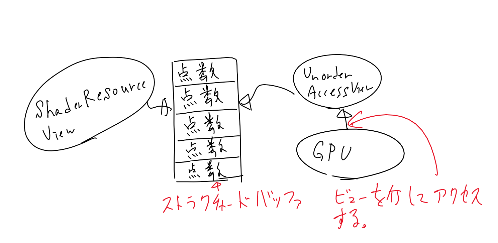
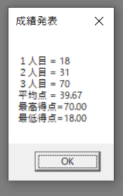
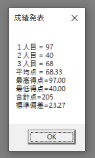
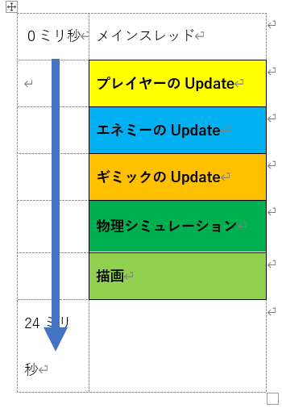
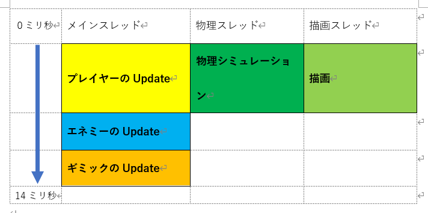
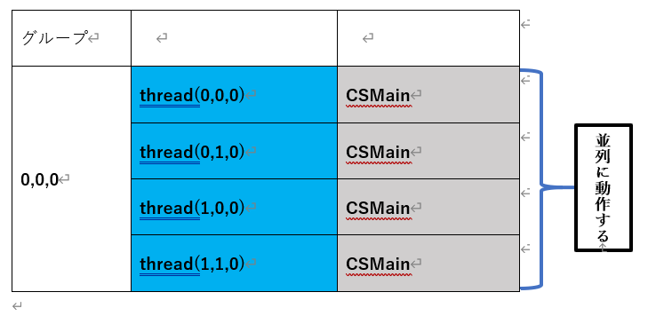
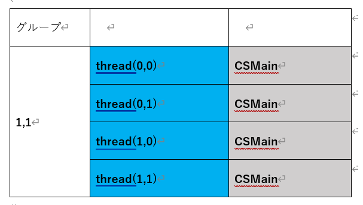

# Chapter 15 コンピュートシェーダー
## 15.1 GPGPU
&emsp;GPGPUとはGeneral-purpose computing on graphics processing unitsの略でGPUに汎用計算を行わせることを指しています。汎用計算とは画像処理以外の処理のことを指します。例えばコリジョン処理など。本来GPUは画像処理を行うために進化してきましたが、プログラマブルシェーダーの登場により、GPUでそれなりに複雑なロジックを実行することができるようになりました。また、CPUはGPUとは異なる進化を遂げてきたため、単純な計算であればCPUとは比べ物にならない速度で処理することができます。そのため、GPUに画像処理だけさせるのは勿体ない、もっと色々な処理をGPUに実行させよう！という考えが生まれます。これがGPGPUの始まりです。近年では仮想通貨のマイニングにGPUが使われたり、AIを飛躍的に進化させた機械学習という大量のデータを扱うアルゴリズムを高速に実行するためにGPUが使われたりしていました(ただし、最近は機械学習に特化したプロセッサをgoogleやMicrosoftが独自に開発したため、GPUが使われることは減っています)。


## 15.2 コンピュートシェーダー
&emsp;さて、ではどのようにGPUで汎用的な演算を行うのでしょうか？これまで皆さんが勉強してきたのは、頂点処理を行うための頂点シェーダーと、ピクセル処理を行うためのピクセルシェーダーのみです。固定機能の時代に比べると、ある程度自由にプログラミングができるようになったとはいえ、まだまだ制約は多いです。頂点シェーダーからの出力結果に計算の結果を簡単に加工することはできませんし、ピクセルシェーダーからの出力もカラー情報しか出力できません。DirectX9までは、この二つのシェーダーステージしか用意されていませんでした。(しかし、ゲーム開発者はこの制限のなかでもGPGPUをおこなっていましたが・・・)。そこで、GPUに汎用的な処理を行わせるプログラムを簡単に記述したい、という開発者の要望に答える形で、DirectX10にコンピュートシェーダーという新しいシェーダーステージが追加されました。
コンピュートシェーダーはhlslで記述することができ、より柔軟に計算結果を出力することができるようになっています。

## 15.3 データの入力と出力
&emsp;多くの処理ではいろいろな計算を行うためにはデータを入力する必要があります。そしてその入力に対する計算結果を出力する必要もあるでしょう。クラスの平均点を求める関数であれば、リスト15.1のような実装になると思います。</br>

【リスト15.1】
```cpp
int CalcAvarage( int numStudent, int* scoreArray )
{
	int totalScore = 0;
	for( int I = 0; I < numStudent; i++ ){
	totalScore += scoreArray[i];
	}
	return totalScore / numStudent;
}
```
このクラスの平均点を求める計算をGPUに行わせる場合も同様にGPUに対して生徒数と点数の配列を送ってやる必要があります。そして、GPUで行った計算結果を出力する必要があります。

## 15.4 StructuredBuffer
&emsp;StructuredBufferとは構造化バッファと呼ばれるもので、構造体の配列のように扱うことができます。今回扱うサンプルプログラムでは、シェーダーへの入力、出力として使用しています。

## 15.5 アンオーダーアクセスビューとシェーダーリソースビュー
&emsp;データの入力はピクセルシェーダーや頂点シェーダーと同じように、定数バッファやシェーダーリソースビューなどを利用して入力します。しかし、これらは読み取り専用となっており、データの出力では利用できません。そこで、今回はデータの出力が可能なアンオーダーアクセスビューを使用します。ビューというのはリソースの振る舞いについて定義するためのものです。例えば、シェーダーリソースビューが指定されたリソースは読み取り専用になります。一方アンオーダーアクセスビューが設定されたリソースはランダムアクセスが可能になり、読み書きが可能になります。リスト15.1のプログラムですと、CaclAvarageの引数で渡しているデータはシェーダーリソースビュー、戻り値のデータはアンオーダーアクセスビューに関連付けされます。</br>

**図15.1**</br>
</img></br>

## 15.6 学生の平均点を計算するプログラム
&emsp;では、具体的なプログラムを見て、コンピュートシェーダーの使い方を学んでいきましょう。Sample_15_1/Sample_15_1.slnを起動して実行してください。このプログラムは3人の生徒の試験の成績をランダムに生成して、その平均点を計算して図15.2のように表示しているだけの簡単なプログラムです。</br>
**図15.2**</br>
</img></br>

### 15.6.1　コンピュートシェーダーのロード
&emsp;まず、コンピュートシェーダーをロードする必要があります。シェーダーのロードの処理は頂点シェーダーやピクセルシェーダーと同じように、シェーダーファイルのファイルパスとエントリーポイントとなる関数名を指定します。</br>
[リスト 15.2 main.cpp 27行目～]
```cpp
//コンピュートシェーダのロード
Shader cs;
cs.LoadCS(L"Assets/shader/sample.fx", "CSMain");
```

### 15.6.2　入力データを受け取るバッファを作成
&emsp;続いて、入力データを受け取るバッファを作成します。コンピュートシェーダもGPU上で動作するので、当然アクセスできるのはグラフィックメモリですので、グラフィックメモリ上にバッファを作成する必要があります。今回は入力データは読み取り専用のストラクチャードバッファとして作成しています。</br>
[リスト 15.3 main.cpp 39行目～]
```cpp
//入力データを受け取るバッファを作成。
int inputData[] = {
	20, 30, 40
};

StructuredBuffer inputSB;
inputSB.Init(sizeof(int), 3, inputData);
```

### 15.6.3 出力データを受け取るバッファを作成
&emsp;入力データが作成できたら、今度は出力データを記憶するバッファを作成します。出力データは読み書き可能なストラクチャードバッファとして作成しています。</br>
[リスト 15.4 main.cpp 47行目～]
```cpp
//出力データを受け取るバッファを作成。
RWStructuredBuffer outputSb;
outputSb.Init(sizeof(OutputData), 1, nullptr);
```

### 15.6.4 ディスクリプタヒープへの登録
&emsp;入力データと出力データをディスクリプタヒープに登録します。これも頂点シェーダー、ピクセルシェーダと変わりありません。入力データはシェーダーリソースビュー、出力データはアンオーダーアクセスビューとして登録します。</br>
[リスト 15.5 main.cpp 49行目～]
```cpp
DescriptorHeap ds;
ds.RegistShaderResource(0, inputSB);
ds.RegistUnorderAccessResource(0, outputSb);
ds.Commit();
```

### 15.6.5 ディスパッチコール
&emsp;ディスパッチコールを実行することで、設定されていたコンピュートシェーダーが実行されます。絵を描くときのドローコール似たような感じです。ディスパッチコールを行うために必要なリソースを設定して実行します。</br>
[リスト 15.6 main.cpp 76行目～]
```cpp
//////////////////////////////////////
//ここからDirectComputeへのディスパッチ命令。
//////////////////////////////////////
renderContext.SetComputeRootSignature(rs);
renderContext.SetPipelineState(pipelineState);
renderContext.SetComputeDescriptorHeap(ds);
renderContext.Dispatch(1, 1, 1);
```
### 15.6.6 コンピュートシェーダー
&emsp;では、最後にコンピュートシェーダーのコードを見ていきましょう。やっていることは平均点、最高点、最小点の計算を行っているだけです。</br>
&emsp;入力データにアクセスするための変数と、出力データにアクセスするための変数が用意されています。入力データはシェーダーリソースビューなのでtレジスタに割り当てられています。出力データはuレジスタに割り当てられています。
[リスト 15.7 Assets/shader/sample.fx]
```cpp
// 平均点、最高得点、最低得点を計算するコンピュートシェーダー。
#define NUM_STUDENT 3.0f //生徒の数

//出力データ構造体
struct OutputData{
	float avarageScore;	//平均点。
	float maxScore;		//最高点。
	float minScore;		//最小点。
};

//入力データにアクセスるための変数。
StructuredBuffer<int> g_scores : register(t0);
//出力先にアクセスするための変数。
RWStructuredBuffer<OutputData> g_outputData : register(u0);

//これがエントリーポイント
[numthreads(1, 1, 1)] //これは今は気にしなくてよい。
void CSMain( uint3 DTid : SV_DispatchThreadID )
{
	g_outputData[0].maxScore = 0;
	g_outputData[0].minScore = 100;

	int totalScore = 0;
	for(int i = 0; i < NUM_STUDENT; i++ ){
		totalScore += g_scores[i];
		g_outputData[0].maxScore = max( g_outputData[0].maxScore, g_scores[i]);
		g_outputData[0].minScore = min( g_outputData[0].minScore, g_scores[i]);
	}
	g_outputData[0].avarageScore = totalScore / NUM_STUDENT;
}
```
## 15.7 【ハンズオン】合計点を出力する
&emsp;では、Sample_15_01を改造して、合計点を出力できるようにしてみましょう。まず、コンピュートシェーダーを改造しましょう。</br>
### 15.7.1 step-1 出力構造体にメンバを追加する(HLSL)
&emsp;sample.fxの「step-1 出力構造体にメンバを追加する」と書かれている箇所にリスト15.8のプログラムを追加してください。</br>
[リスト 15.8 sample.fx]
```hlsl
//step-1 出力構造体にメンバを追加する
int totalScore;		//合計点。
```

### 15.7.2 step-2 合計点を出力する(HLSL)
&emsp;メンバを追加できたら、実際に出力するプログラムをウ生かします。「step-2 合計点を出力する」と書かれている箇所にリスト15.9のプログラムを追加してください。</br>
[リスト 15.9 sample.fx]
```hlsl
//step-2 合計点を出力する
g_outputData[0].totalScore = totalScore;
```

### 15.7.3 step-3 出力構造体にメンバを追加する(C++)
&emsp;続いて、コンピュートシェーダーで計算されたデータを受け取るために、C++側に定義されている出力構造体にもメンバを追加しましょう。main.cppの「step-3 出力構造体にメンバを追加する」と書かれている箇所にリスト15.10のプログラムを追加してください。</br>
[リスト 15.10]
```cpp
//step-3 出力構造体にメンバを追加する
int totalScore;		//合計点。
```
### 15.7.4 step-4 合計点を表示する(C++)
&emsp;では最後のハンズオンです。main.cppの「step-4 合計点を表示する」と書かれている箇所にリスト15.11のプログラムを追加して、メッセージボックスに合計点の表示を追加してみましょう。
[リスト 15.11]
```cpp
//step-4 合計点を表示する
sprintf(
	text, 
	"１人目 = %d\n" \
	"２人目 = %d\n" \
	"３人目 = %d\n" \
	"平均点 = %0.2f\n" \
	"最高得点=%0.2f\n" \
	"最低得点=%0.2f\n" \
	"合計点=%d\n", //これを追加。
	inputData[0], 
	inputData[1], 
	inputData[2],
	outputData->avarageScore, 
	outputData->maxScore, 
	outputData->minScore,
	outputData->totalScore //これも追加。
);
```
<!-- 改ページ. -->
<div style="page-break-before:always"></div>

## 15.8【課題】標準偏差を計算する
&emsp;Sample_15_01を改造して、図15.3のように標準偏差を表示できるようにしなさい。</br>
**図15.3**</br>
<!-- どこかのサイトから拾ってきた画像です。差し替えをお願いします。 -->
</img></br>

標準偏差の計算はGPUで行いなさい。標準偏差は下記の数式で求めることができます。</br>

</img></br>

答え:Sample_15_01/Assets/shader/main_15_8.fx、Sample_15_01/main_15_8.cpp</br>
<!-- 改ページ. -->
<div style="page-break-before:always"></div>

## 15.9 コンピュートシェーダーの並列処理
&emsp;この節では、画像のモノクロ化のサンプルプログラムを通して、コンピュートシェーダーの並列処理について学んでいきます。

### 15.9.1 スレッド
&emsp;すべてのプログラムはスレッドによって実行されています。驚くかもしれませんが、実はこれまで、あなたが記述したmain関数はメインスレッドから呼ばれていたのです。スレッドは複数作成することができて、作成されたスレッドは並列に動作します。例えば、あるゲームの１フレームの処理が図15.4のようになっていると考えてみましょう。</br>
**図15.4**</br>
</img></br>
&emsp;このゲームではメインスレッドに記述されているゲームループから順次処理を呼び出していて、1フレームの処理が完了するまでに24ミリ秒かかっています。残念ながらこのゲームは60fpsを達成できていないため、ゲームプレイの滑らかさは多少損なわれています。図15.5はスレッドを二つ立てて、ゲームの処理、物理シミュレーション、描画処理を並列に実行している様子です。</br>

**図15.5**</br>
</img></br>
&emsp;物理シミュレーションと描画処理を並列に実行するようにしたことで、１フレームの処理時間が14ミリ秒まで短縮できました！これで60fpsが達成できました！(現実はデータの排他など非常に難解なことを考える必要が出てくるため、マルチスレッドにするということはここまで簡単な話ではないので注意してください。)コンピュートシェーダーもスレッドから実行されており、ディスパッチされると、スレッドが生成されます。生成されるスレッドの数はコンピュートシェーダーのコードで指定することができます。</br>

```cpp
[numthreads(2, 2, 1)] //これがスレッドの数！！！                                                                                
void CSMain( uint3 DTid : SV_DispatchThreadID)
{
　　　・
　　　・
　　　・
}
```
&emsp;numthreads(x,y,z)という文が一つのスレッドグループで生成されるスレッド数を指定しています(スレッドグループについては後述します)。この場合生成されるスレッド数は2×2×1の4スレッド生成されます。numthreads(4, 1, 1)と同じ意味になるのですが、例えば入力データを二次元配列のように扱いたい場合、このように指定したほうが扱いやすくなります。</br>

### 15.9.2 スレッドグループ
&emsp;スレッドグループとはスレッドをひとまとめにしたものです。スレッドグループの数はコンピュートシェーダーをディスパッチするときに指定することができます。</br>
```cpp
//3×3のスレッドグループが作られる！
renderContext.Dispatch(3,3,1);
```
&emsp;Dispatch関数の引数がスレッドグループの数です。この場合スレッドグループの数は3×3×1の9グループとなります。では15.9.1の4スレッド生成するコンピュートシェーダーを3×3×1の9グループでディスパッチするとどのようになるか見てみいきましょう。まずディスパッチされると(0,0,0)のグループの4スレッドが起動してCSMainが実行されます。</br>
**図15.6**</br>
</img></br>
(0,0,0)のスレッドがすべて終了すると(0,1,0)のグループが実行されます。</br>

**図15.7**</br>
</img></br>
続いて(0,2,0)、(1,0,0)と実行されて最後に(2,2,0)を実行するとコンピュートシェーダーは終了します。</br>

### 15.9.3 SV_DispatchThreadIDセマンティクス
&emsp;コンピュートシェーダ―では、メイン関数の引数にSV_DispatchThreadIDセマンティクスを指定することができます。このセマンティクスを指定するとメイン関数を呼び出しているスレッドのIDを引っ張ってくるができます。このIDは3次元ベクトルになります。例えば、スレッドＡのIDは(3,4,3)、スレッドＢのIDは(10, 2, 1)といったものです。例えば、２×２×１のスレッドで実行されるコンピュートシェーダ―を４×３×１のスレッドグループでディスパッチすると、スレッドIDは(0,0,0)～(8,6,1)になります。

### 15.9.4 【ハンズオン】モノクロ画像を生成する
&emsp;ではSample_15_02を改造して、ロードしたビットマップフォーマットの画像をモノクロに変換するプログラムを作成してみましょう。ビットマップフォーマットは端的に説明すると、下記のコードのような光の三原色のデータの配列です。
```cpp
//1ピクセルのデータ構造体。
struct SRgb{
	unsigned char r;
	unsigned char g;
	unsigned char b;
	unsigned char a;
};
//画像データ。ピクセルの集合体。
SRgb image[512×512];
```
#### step-1 画像データをメインメモリ上にロードする。
&emsp;では、ハンズオンを行っていきます。今回はAssets/image/original.bmpをモノクロ化します。まずは画像データをメインメモリ上にロードします。リスト15.12を入力してください。なお、このサンプルプログラムにはビットマップ画像をロードできるBitmapクラスを用意しています。このクラスは簡易的なクラスであるため、全てのビットマップ画像を扱えるわけではないので注意してください。</br>
[リスト15.2 main.cpp 22行目～]
```cpp
Bitmap imagebmp;
imagebmp.Load("Assets/image/original.bmp");
```
&emsp;
#### step-2  画像データをグラフィックメモリに送るためにストラクチャードバッファを作成する。
&emsp;step-1でロードした画像データはメインメモリに乗っています。今回はコンピュートシェーダ―でモノクロ化を行うため、グラフィックメモリに転送する必要があります。リスト15.3のプログラムを入力して、ストラクチャードバッファを作成しましょう。</br>
[リスト15.3 main.cpp 26行目～]
```cpp
StructuredBuffer inputImageBmpSB;
inputImageBmpSB.Init(
	imagebmp.GetPixelSizeInBytes(), //第一引数は1画素のサイズ。
	imagebmp.GetNumPixel(),			//ピクセルの数を取得。
	imagebmp.GetImageAddress()		//画像データの先頭アドレス。
);
```

#### step-3 モノクロ化した画像を受け取るためのRWストラクチャバッファを作成。
&emsp;では、続いてモノクロ化した画像を受け取るためのRWストラクチャバッファを作成します。リスト15.4のプログラムを入力してください。</br>
[リスト15.4 main.cpp 31行目～]
```cpp
RWStructuredBuffer outputImageBmpRWSB;
outputImageBmpRWSB.Init(
	imagebmp.GetPixelSizeInBytes(), //第一引数は1画素のサイズ。
	imagebmp.GetNumPixel(),			//ピクセルの数を取得。
	imagebmp.GetImageAddress()		//画像データの先頭アドレス。
);
```

#### step-4 入力データと出力データをディスクリプタヒープに登録する。
&emsp;入力データと出力データを受け取るためのバッファを作成出来たら、バッファをディスクリプタヒープに登録します。リスト15.5のプログラムを入力してください。</br>
[リスト15.5 main.cpp 42行目～]
```cpp
DescriptorHeap ds;
ds.RegistShaderResource(0, inputImageBmpSB);
ds.RegistUnorderAccessResource(0, outputImageBmpRWSB);
ds.Commit();
```

#### step-5 ディスパッチコールを実行する。
&emsp;step-4までで準備が完了したので、ディスパッチコールを実行します。リスト15.6のプログラムを入力してください。</br>
[リスト15.6 main.cpp 70行目～]
```cpp
renderContext.SetComputeRootSignature(rs);
renderContext.SetPipelineState(pipelineState);
renderContext.SetComputeDescriptorHeap(ds);
//ピクセル数は512×512 = 262,144ピクセル。
//4つのスレッドを生成するコンピュートシェーダ―なので、
//262,144 ÷ 4 = 65,536個のスレッドグループを作成する。
renderContext.Dispatch(65536, 1, 1);
```

#### step-6 モノクロにした画像を保存。
&emsp;では、これでC++側は最後になります。コンピュートシェーダ―でのモノクロ化の結果を確認するために画像データを保存しましょう。Bitmapクラスには画像をセーブする機能があります。この機能を使ってAssets/imageフォルダの中にmonochrome.bmpという名前で保存します。リスト15.7のプログラムを入力してください。</br>
[リスト15.7 main.cpp 70行目～]
```cpp
//step-6 モノクロにした画像を保存。
imagebmp.Copy(outputImageBmpRWSB.GetResourceOnCPU());
imagebmp.Save("Assets/image/monochrome.bmp");
```

#### step-7 t0、u0に設定されているバッファにアクセスするための変数を定義。
&emsp;続いてシェーダー側のプログラムです。まずは、t0、u0レジスタに設定されているストラクチャードバッファにアクセスるための変数を定義します。Assets/shader/sample.fxを開いて、リスト15.8のプログラムを入力してください。</br>
[リスト15.8 sample.fx 7行目～]
```hlsl
//step-7 t0、u0に設定されているバッファにアクセスするための変数を定義。
StructuredBuffer<uint> inputImage : register( t0 );
RWStructuredBuffer<uint> outputBuffer : register(u0);
```

#### step-8 入力データから画素を引っ張ってきて、モノクロ化。
&emsp;では、これで最後です。コンピュートシェーダ―のメイン関数を実装します。リスト15.9のプログラムを入力してください。</br>
[リスト15.9 sample.fx 36行目～]
```hlsl
//step-8 入力データから画素を引っ張ってきてモノクロ化する。

//スレッドＩＤをりよして画像データから画素を引っ張ってくる。
uint iColor = inputImage[DTid.x];
//0～255の画像データを0.0～1.0に正規化する。
float4 color = UnpackedRGBA32ToFloat4(iColor);

float Y = 0.29900 * color.r + 0.58700 * color.g + 0.11400 * color.b;
color.r = Y;
color.g = Y;
color.b = Y;
color.a = 1.0f;

//float4をRGBA32ビットのフォーマットに変して出力
outputBuffer[DTid.x] = PackedFloat4ToRGBA32( color );
```
&emsp;全て入力出来たらプログラムを実行してみてください。完成していたら、Assets/imageフォルダの中にmonochrome.bmpが出来上がっています。

### 15.9.5 SV_DispatchThreadIDセマンティクスの利用
&emsp;さて、先ほどのハンズオンではスレッドグループが65536個、１つのスレッドグループで実行されるスレッドの数が4個でした。ですので、生成されるスレッド数は65536 × 4 = 262,144個‬になっていました。この���は、今回モノクロ化した画像のピクセル数と同じです(512 × 512 = 262,144)。今回のハンズオンでは、モノクロカする画像のピクセル数と同じになるようにディスパッチされていて、１つのスレッドが１ピクセルをモノクロ化していました。各スレッドが度のピクセルをモノクロ化するかを決めるために、SV_DispatchThreadIDセマンティクスが使われていました。SV_DispatchThreadIDセマンティクスが指定された変数にはスレッドの番号が入っています。今回は0～262,143の番号が渡されます。ちょうどピクセルの画素を配列として扱った場合のインデックスと一致しています。これを利用して、各スレッドに１ピクセルずつモノクロ加工させていたわけです。

### 15.9.6 【課題】解像度の違うoriginal2.bmpをモノクロ化しなさい。
&emsp;Sample_15_02を改造して、original2.bmpをモノクロ化して、monochrome2.bmpという名前で保存しなさい。表15.1のようにoriginal2.bmpはoriginal.bmpとでは解像度が違います。そのため、生成するスレッドの数を変更する必要があります。</br>
**表15.1**</br>
| ファイル名 | 解像度|
| ---- | ---- |
| original.bmp | 512 × 512 |
| original2.bmp | 1024 × 768 |

答え:Sample_15_02/Assets/shader/main_15.9.6.cpp

### 15.9.7 【ハンズオン】original.bmpにガウシアンブラーをかけてボケ画像を生成する。
&emsp;続いて、Sample_15_03を改造して、ロードした画像にガウシアンブラーをかけてボケ画像を生成するプログラムを作成してみましょう。実装するボケ画像生成のアルゴリズムはポストエフェクトの章で勉強したアルゴリズムと同じで、カウス関数で計算した重みテーブルを使って、Xブラー、Yブラーを行って縮小テクスチャを作っていきます。</br>
#### step-1 画像データをメインメモリ上にロードする。
&emsp;まずはBitmapクラスを使って、画像データをロードします。リスト15.10のプログラムを入力してください。</br>
[リスト15.10 main.cpp]
```cpp
//step-1 画像データをメインメモリ上にロードする。
Bitmap imagebmp;
imagebmp.Load("Assets/image/original.bmp");
```
#### step-2 ブレンディング係数を送るための定数バッファを作成。
&emsp;ピクセルの重みテーブルを送るための定数バッファを作成します。リスト15.11のプログラムを入力して下さい。</br>
[リスト15.11 main.cpp]
```cpp
//step-2 ブレンディング係数を送るための定数バッファを作成する。
ConstantBuffer weightsCB;
weightsCB.Init(sizeof(float) * 8, nullptr);
```

#### step-3 テクスチャ情報を送るための定数バッファを作成する。
&emsp;縮小バッファを利用したガウシアンブラーでは、オリジナルのテクスチャ、Xブラーをかけた画像の出力用のテクスチャ、Yブラーをかけた画像の出力用のテクスチャの情報が必要になります。これらをグラフィックメモリに送るために定数バッファを追加します。リスト15.12のプログラムを入力して下さい。</br>
[リスト15.12 main.cpp]
```cpp
//step-3 テクスチャ情報を送るための定数バッファを作成する。
TexInfo texInfo;
texInfo.originalTexSize[0] = imagebmp.GetWidth();
texInfo.originalTexSize[1] = imagebmp.GetHeight();
texInfo.xBlurTexSize[0] = texInfo.originalTexSize[0] / 2;
texInfo.xBlurTexSize[1] = texInfo.originalTexSize[1];
texInfo.yBlurTexSize[0] = texInfo.originalTexSize[0] / 2;
texInfo.yBlurTexSize[1] = texInfo.originalTexSize[1] / 2;
ConstantBuffer texInfoCB;
texInfoCB.Init(sizeof(texInfo), &texInfo);
```

#### step-4 各種ストラクチャードバッファを作成する。
&emsp;今回使用するアルゴリズムでは、オリジナルの画像をGPUに渡すための入力用のバッファと、コンピュートシェーダ―が３回ディスパッチされて、横方向に半分の解像度のテクスチャ(Xブラーの出力結果)、縦横半分の解像度のテクスチャ(Yブラーの出力結果)、オリジナルの画像と同じ解像度のテクスチャ(最終合成の結果)の３つ出力用のバッファが必要となります。では、リスト15.13を入力して、各種ストラクチャードバッファを作成できるようにしてください。</br>
[リスト15.13 main.cpp]
```cpp
//step-4 各種ストラクチャードバッファを作成する。
StructuredBuffer inputImageBmpSB;
inputImageBmpSB.Init(
	imagebmp.GetPixelSizeInBytes(), //第一引数は1画素のサイズ。
	imagebmp.GetNumPixel(),			//ピクセルの数を取得。
	imagebmp.GetImageAddress()		//画像データの先頭アドレス。
);

//Xブラーをかけた画像を出力するためのRWストラクチャバッファを作成。
RWStructuredBuffer outputXBlurImageRWSB;
outputXBlurImageRWSB.Init(
	imagebmp.GetPixelSizeInBytes(), //第一引数は1画素のサイズ。
	imagebmp.GetNumPixel() / 2,		//横方向に1/2の解像度へダウンサンプリングを行うのでピクセル数を半分にする。
	nullptr
);

//Yブラーをかけた画像を出力するためのRWストラクチャバッファを作成。
RWStructuredBuffer outputYBlurImageRWSB;
outputYBlurImageRWSB.Init(
	imagebmp.GetPixelSizeInBytes(), //第一引数は1画素のサイズ。
	imagebmp.GetNumPixel() / 4,		//縦、横方向に1/2の解像度へダウンサンプリングを行うのでピクセル数を1/4にする。
	nullptr
);
//最終結果を出力するためのRWストラクチャバッファを作成。
RWStructuredBuffer finalImageRWSB;
finalImageRWSB.Init(
	imagebmp.GetPixelSizeInBytes(), //第一引数は1画素のサイズ。
	imagebmp.GetNumPixel(),	
	nullptr
);
```

#### step-5 各種ディスクリプタヒープを作成する。
&emsp;続いて各種ディスクリプタヒープの作成です。今回はコンピュートシェーダを３回ディスパッチしますが、そのために入力用のバッファと出力用のバッファが異なります。そこで、各ディスパッチ用のディスクリプタ―ヒープを作成する必要があります。リスト15.14のプログラムを入力してください。</br>
[リスト15.14 main.cpp]
```cpp
//step-5 各種ディスクリプタヒープを作成する。
//Xブラー用のディスクリプタヒープを作成。
DescriptorHeap xBlurDS;
xBlurDS.RegistShaderResource(0, inputImageBmpSB);
xBlurDS.RegistConstantBuffer(0, weightsCB);
xBlurDS.RegistConstantBuffer(1, texInfoCB);
xBlurDS.RegistUnorderAccessResource(0, outputXBlurImageRWSB);
xBlurDS.Commit();

//Yブラー用のディスクリプタヒープを作成。
DescriptorHeap yBlurDS;
yBlurDS.RegistShaderResource(0, outputXBlurImageRWSB);
yBlurDS.RegistConstantBuffer(0, weightsCB);
yBlurDS.RegistConstantBuffer(1, texInfoCB);
yBlurDS.RegistUnorderAccessResource(0, outputYBlurImageRWSB);
yBlurDS.Commit();

//最終結果出力用のディスクリプタヒープを作成。
DescriptorHeap finalDS;
finalDS.RegistShaderResource(0, outputYBlurImageRWSB);
finalDS.RegistConstantBuffer(0, weightsCB);
finalDS.RegistConstantBuffer(1, texInfoCB);
finalDS.RegistUnorderAccessResource(0, finalImageRWSB);
finalDS.Commit();
```

#### step-6 各種パイプラインステートを作成する。
&emsp;続いてパイプラインステートの作成です。パイプラインステートもディスパッチのたびにシェーダーが変更されるため、ディスパッチの数分だけ作成する必要があります。リスト15.15のプログラムを入力してください。</br>
[リスト15.15 main.cpp]
```cpp
//step-6 各種パイプラインステートを作成する。

//Xブラー用のパイプラインステートを作成。
//Xブラー用のコンピュートシェーダをロードする。
Shader xblurCS;
xblurCS.LoadCS("Assets/shader/sample.fx", "XBlur");
//パイプラインステートを作成する。
PipelineState xBlurPipelineState;
InitPipelineState(rs, xBlurPipelineState, xblurCS);

//Yブラー用のパイプラインステートを作成。
//Yブラー用のコンピュートシェーダのロード
Shader yblurCS;
yblurCS.LoadCS("Assets/shader/sample.fx", "YBlur");
//パイプラインステートを作成。
PipelineState yBlurPipelineState;
InitPipelineState(rs, yBlurPipelineState, yblurCS);

//最終出力用のパイプラインステートを作成。
//最終出力用のコンピュートシェーダーのロード。
Shader finalCS;
finalCS.LoadCS("Assets/shader/sample.fx", "Final");
//パイプラインステートを作成。
PipelineState finalPipelineState;
InitPipelineState(rs, finalPipelineState, finalCS);
```

#### step-7 各種コンピュートシェーダ―をディスパッチ
&emsp;これで、cpp側は最後になります。準備が整ったので、各種コンピュートシェーダーをディスパッチしていきましょう。リスト15.16のプログラムを入力してください。</br>

[リスト15.16 main.cpp]
```cpp
//step-7 各種コンピュートシェーダ―をディスパッチ
//Xブラーをディスパッチ。
renderContext.SetPipelineState(xBlurPipelineState);
renderContext.SetComputeDescriptorHeap(xBlurDS);
renderContext.Dispatch(texInfo.xBlurTexSize[0] / 4, texInfo.xBlurTexSize[1] / 4, 1);

//Yブラーをディスパッチ。
renderContext.SetPipelineState(yBlurPipelineState);
renderContext.SetComputeDescriptorHeap(yBlurDS);
renderContext.Dispatch(texInfo.yBlurTexSize[0] / 4, texInfo.yBlurTexSize[1] / 4, 1);

//最終合成をディスパッチ。
renderContext.SetPipelineState(finalPipelineState);
renderContext.SetComputeDescriptorHeap(finalDS);
renderContext.Dispatch(texInfo.originalTexSize[0] / 4, texInfo.originalTexSize[1] / 4, 1);
```

#### step-8 各種定数バッファにアクセスするための変数を定義。
&emsp;ここからはシェーダー側のプログラムになります。下まずは定数バッファにアクセスするための変数を定義します。Assets/shader/sample.fxを開いてリスト15.17のプログラムを入力して下さい。</br>
[リスト15.17 sample.fx]
```cpp
//step-8 各種定数バッファにアクセスするための変数を定義。
//定数バッファ
cbuffer cb_0 : register(b0) {
	float4 weights[2];
	
};
//テクスチャ情報用の定数バッファ。
cbuffer texInfoCB : register(b1){
	int2 texSize;			//オリジナルテクスチャのサイズ
	int2 xBlurTexSize;		//Xブラーの出力先のテクスチャのサイズ。
	int2 yBlurTexSize;		//Yブラーの出力先のテクスチャのサイズ。
};

```

#### step-9 入出力画像にアクセスするための変数を定義。
&emsp;続いて、入出力用の画像にアクセスするための変数を定義します。リスト15.18のプログラムを入力してください。</br>
[リスト 15.18 sample.fx]
```cpp
StructuredBuffer<uint> inputImage : register(t0);
RWStructuredBuffer<uint> outputImage : register(u0);
```
<!-- 改ページ. -->
<div style="page-break-before:always"></div>

#### step-10 Xブラーを実装
&emsp;いよいよコンピュートシェーダー本体の実装です。まずはXブラーの実装。Xブラーは基準テクセルから左右に８テクセルの合計１６テクセルをブレンディングしていきます。リスト15.19のプログラムを入力してください。</br>
[リスト 15.19 sample.fx]
```cpp
[numthreads(4, 4, 1)]
void XBlur( uint3 DTid : SV_DispatchThreadID)
{
	uint2 basepos = uint2( DTid.x * 2, DTid.y);
	
	float4 color = GetPixelColor( basepos.x, basepos.y, texSize ) * weights[0].x;
	color += GetPixelColor( basepos.x + 1, basepos.y, texSize ) * weights[0].y;
	color += GetPixelColor( basepos.x + 2, basepos.y, texSize ) * weights[0].z;
	color += GetPixelColor( basepos.x + 3, basepos.y, texSize ) * weights[0].w;
	color += GetPixelColor( basepos.x + 4, basepos.y, texSize ) * weights[1].x;
	color += GetPixelColor( basepos.x + 5, basepos.y, texSize ) * weights[1].y;
	color += GetPixelColor( basepos.x + 6, basepos.y, texSize ) * weights[1].z;
	color += GetPixelColor( basepos.x + 7, basepos.y, texSize ) * weights[1].w;

	color += GetPixelColor( basepos.x - 1, basepos.y, texSize ) * weights[0].y;
	color += GetPixelColor( basepos.x - 2, basepos.y, texSize ) * weights[0].z;
	color += GetPixelColor( basepos.x - 3, basepos.y, texSize ) * weights[0].w;
	color += GetPixelColor( basepos.x - 4, basepos.y, texSize ) * weights[1].x;
	color += GetPixelColor( basepos.x - 5, basepos.y, texSize ) * weights[1].y;
	color += GetPixelColor( basepos.x - 6, basepos.y, texSize ) * weights[1].z;
	color += GetPixelColor( basepos.x - 7, basepos.y, texSize ) * weights[1].w;

	uint pixelIndex = GetPixelIndexFromXYCoord( DTid.x, DTid.y, xBlurTexSize.x);
	outputImage[pixelIndex] = PackedFloat4ToRGBA32(color);
}
```
#### step-11 Yブラーを実装
&emsp;続いてYブラーです。YブラーはXブラーをかけた画像に対して行っています。基準テクセルから上下に８テクセルの合計１６テクセルをブレンディングしていきます。リスト15.20のプログラムを入力してください。</br>
[リスト 15.20 sample.fx]
```cpp
//step-11 Yブラーを実装。
[numthreads(4, 4, 1)]
void YBlur(uint3 DTid : SV_DispatchThreadID)
{
	uint2 basepos = uint2( DTid.x, DTid.y * 2);

	float4 color = GetPixelColor( basepos.x, basepos.y, xBlurTexSize ) * weights[0].x;
	color += GetPixelColor( basepos.x, basepos.y + 1, xBlurTexSize ) * weights[0].y;
	color += GetPixelColor( basepos.x, basepos.y + 2, xBlurTexSize ) * weights[0].z;
	color += GetPixelColor( basepos.x, basepos.y + 3, xBlurTexSize ) * weights[0].w;
	color += GetPixelColor( basepos.x, basepos.y + 4, xBlurTexSize ) * weights[1].x;
	color += GetPixelColor( basepos.x, basepos.y + 5, xBlurTexSize ) * weights[1].y;
	color += GetPixelColor( basepos.x, basepos.y + 6, xBlurTexSize ) * weights[1].z;
	color += GetPixelColor( basepos.x, basepos.y + 7, xBlurTexSize ) * weights[1].w;

	color += GetPixelColor( basepos.x, basepos.y - 1, xBlurTexSize ) * weights[0].y;
	color += GetPixelColor( basepos.x, basepos.y - 2, xBlurTexSize ) * weights[0].z;
	color += GetPixelColor( basepos.x, basepos.y - 3, xBlurTexSize ) * weights[0].w;
	color += GetPixelColor( basepos.x, basepos.y - 4, xBlurTexSize ) * weights[1].x;
	color += GetPixelColor( basepos.x, basepos.y - 5, xBlurTexSize ) * weights[1].y;
	color += GetPixelColor( basepos.x, basepos.y - 6, xBlurTexSize ) * weights[1].z;
	color += GetPixelColor( basepos.x, basepos.y - 7, xBlurTexSize ) * weights[1].w;

	uint pixelIndex = GetPixelIndexFromXYCoord( DTid.x, DTid.y, yBlurTexSize.x);
	outputImage[pixelIndex] = PackedFloat4ToRGBA32(color);
}

```

#### step-12 最終出力を実装
&emsp;いよいよ最後です。最後はYブラーをかけた画像にバイリニアフィルタをかけて、元画像の解像度にアップサンプリングしています。リスト15.21のプログラムを入力してください。</br>
[リスト 15.21 sample.fx]
```cpp
//step-12 最終出力を実装
[numthreads(4, 4, 1)]
void Final(uint3 DTid : SV_DispatchThreadID)
{
	//バイリニアフィルタをかける。
	uint2 basepos = uint2( DTid.x / 2, DTid. y /2 );
	float4 color = GetPixelColor( basepos.x, basepos.y, yBlurTexSize );
	color += GetPixelColor( basepos.x, basepos.y + 1, yBlurTexSize );
	color += GetPixelColor( basepos.x + 1, basepos.y, yBlurTexSize );
	color += GetPixelColor( basepos.x + 1, basepos.y + 1, yBlurTexSize );

	//加重平均を取る。
	color /= 4.0f;
	uint pixelIndex = GetPixelIndexFromXYCoord( DTid.x, DTid.y, texSize.x);
	outputImage[pixelIndex] = PackedFloat4ToRGBA32(color);
}
```

#### step-13 実行
ここまで実装できたら実行して見てください。Assets/imageフォルダの中にblur.bmpという図15.8のような画像が出来上がっていたら完成です。</br>
**図15.8**</br>
</img></br>

<!-- 改ページ. -->
<div style="page-break-before:always"></div>