# Chapter 7 物理ベースレンダリング(PBR)
このチャプターでは、現在のハイエンドゲームのライティングの計算のディファクトスタンダードになっている、物理ベースレンダリング(PBR)、について見ていきます。物理ベースということで、インターネットなどで調べると、難しい話がたくさん出てくるのですが、本書では難しい言葉はできるだけ使わずに、かみ砕いて説明をしていきます。
## 7.1 PBRとは
PBRはPlayStation4やXBoxOneなどが登場して、トレンドとなった技術の１つです。PBRを大雑把に説明すると、ライティングの計算で物理法則に従った計算をしましょう、というものになります。すでに皆さんはChpater5でPhongの反射モデルを利用したライティングを勉強しました。Phongの反射モデルはPlayStation3の世代のゲームでは、広く使われていたものですが、物理的に正しいライティングの計算ではありませんでした。PlayStation3世代のGPUでは、まだまだ物理的に正しい計算を行えるほどのパワーが足りていなかったのです。しかし、PlayStation4やXBoxOne世代になってくると、物理的に正しい計算を行えるようになってきて、PBRを採用したゲームが多数登場してくることとなります。現在、ハイエンドゲ－ムにおいてはPBRがデファクトスタンダードになっていると考えて良いです。</br>
では、物理的に正しいシェーダーというのはどういうことかを考えていきます。PBRで言われている、物理的に正しいというのは、次の二つの法則を満たすことを指していいます。
1. エネルギー保存の法則
2. ヘルムホルツの相反性

エネルギー保存の法則というのは、入射してきた光より強い光を跳ね返さないということです。光は物体に入射すると反射と屈折を起こします(図7.1)。このとき、反射する光と、屈折する光を合算したエネルギーの総量は、入射してきた光より大きくなることはありません。これがエネルギー保存の法則です。ざっくりと説明すると、「当たっている光よりも強いエネルギーを跳ね返してはいけない」という考えてください。</br>
**図7.1**</br>
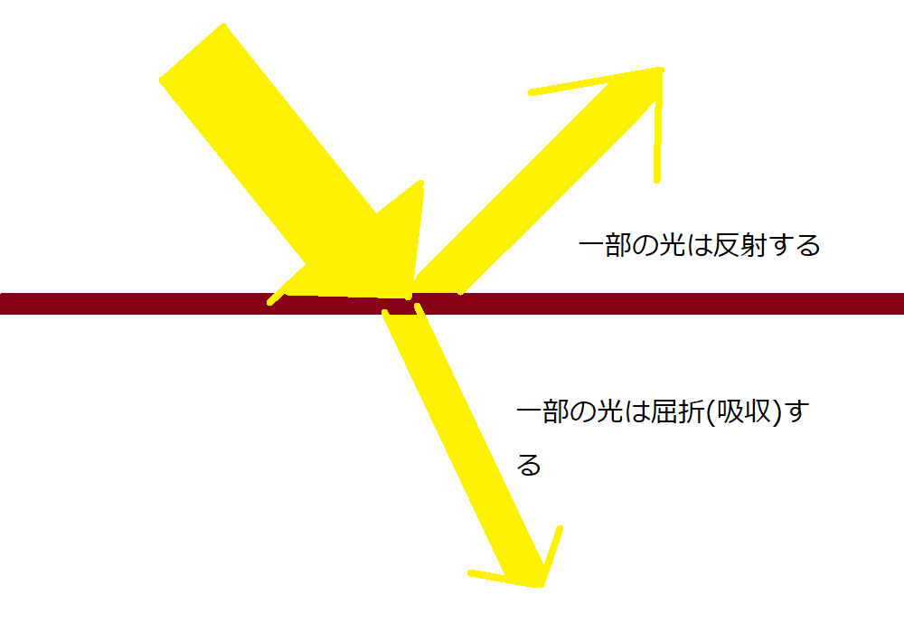</img></br>
ヘルムホルツの相反性というのは、光が入射してくる方向と射出する方向が入れ替わっても光の射出量の結果が変わらないという性質です(図7.2)。</br>

**図7.2**</br>
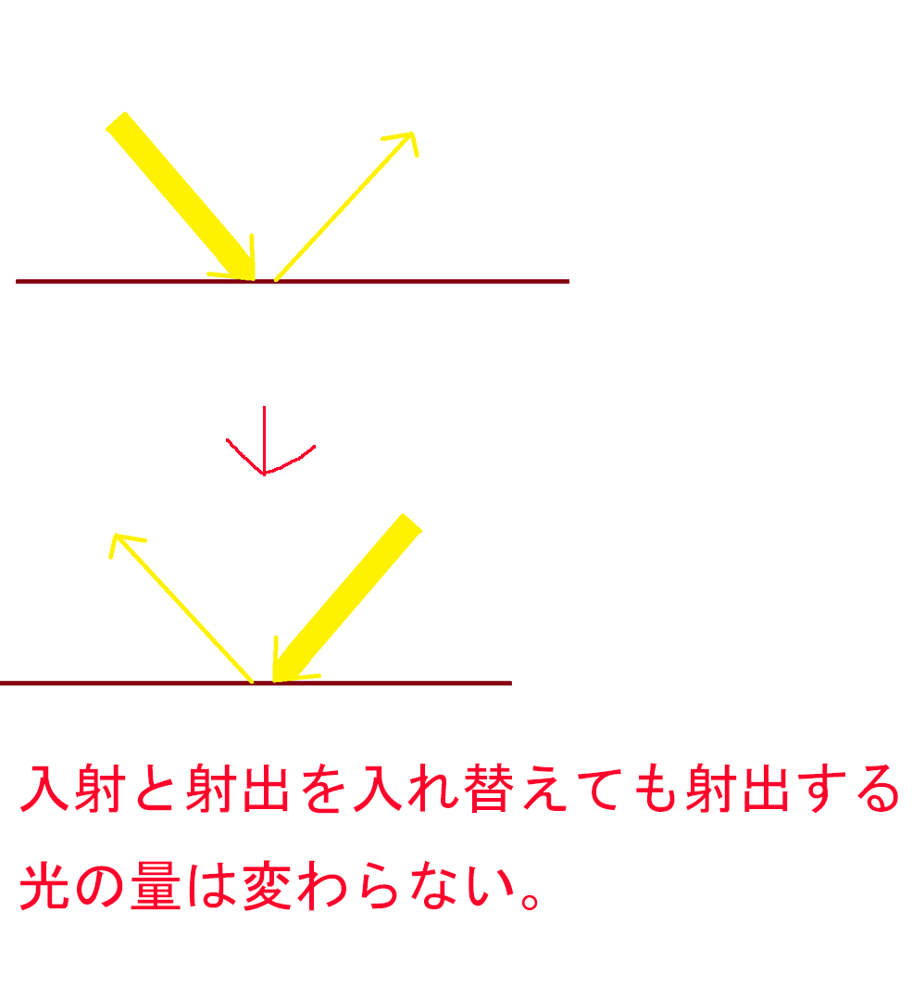</img></br>

Chapter5で勉強したランバート拡散反射はヘルムホルツの相反性は満たしていますが、エネルギー保存の法則は満たしていないため、物理ベースのライティングモデルではありません。ランバート拡散反射のエネルギーの総量を積分すると、入射エネルギーのπ倍になっていることが知られています。そこで、物理ベースの拡散反射の計算モデルとして、ランバート拡散反射の結果を、円周率のπで除算した、**正規化ランバート拡散反射**が採用されていることがあります。

### 7.1.1 【ハンズオン】正規化ランバート拡散反射の実装
では、正規化ランバート拡散反射を実装してみましょう。正規化ランバート拡散反射の実装は非常に簡単で、ランバート拡散反射で計算した反射光を円周率πで割り算を行うだけです。`Sample_07_01/Sample_07_01.sln`を立ち上げてください。

#### step-1 拡散反射光を正規化する
`Assets/shader/sample.fx`を開いて、80行目にリスト7.1のプログラムを入力して下さい。</br>
[リスト7.1 `sample.fx`]
```cpp
//step-1 拡散反射光を正規化する。
diffuse /= 3.1415926f;
```
今回のハンズオンはこれだけで完了です。実行してみてください。拡散反射正規化する前と後で図7.3のような違いが生まれます。</br>
**図7.3**</br>
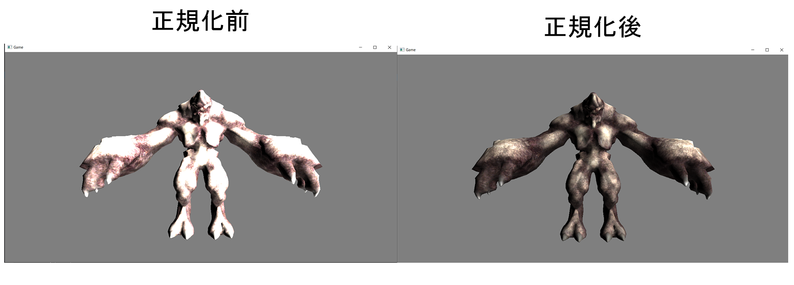</img></br>
結果自体は、反射光の総量が減っているだけで、ライトの明るさが弱くなっているだけです。重要なのは反射光が入射光の強さを超えていないという点です。では、なぜこれが重要なのか？この点について、2012年のSIGGRAPH(アメリカコンピュータ学会におけるコンピュータグラフィックス (CG) を扱う分科会)で発表された、ウォルトディズニーの論文を元に次の節で解説していきます。

## 7.2 Disney based PBR
2012年、SIGGRAPHでウォルト・ディズニーが物理ベースレンダリングに関する論文を発表しました。この論文には「塔の上のラプンツェル」の髪の毛の表現のために、物理ベースのシェーダーを開発したと記述されていました。物理ベースのシェーダーを開発した理由は、単一のシェーダーで、物理的なパラメーター(屈折率、表面の粗さ、金属度、異方性の度合)などの変更を行うだけで、髪の毛の様々な表現(ツヤのある髪、傷んでいる髪などの表現)を可能にするためだったと記述されています。このシェーダーを開発したことにより、目的となっていた髪の毛の豊かな表現というのは実現できました。しかし一方で、物理ベースではないシェーダーを利用している、その他のマテリアルとの統合に苦労したようです。物理ベースレンダリングが行われる以前は、豊かな表現を行うために、様々なシェーダーが作成されていました。しかし、これらのシェーダーは物理的に正しいシェーダーではないため、エネルギー保存の法則やヘルムホルツの相反性を無視しています。そうなると、どうなるかというと、同じ強さのライトを当てたときに、光輝いているマテリアルと、暗くどよんとしているマテリアルが存在するわけです。例えば、あなたが蛍光灯がついている部屋に入った時に、あなたは蛍光灯の光を浴びるわけですが、顔は光輝いてしまっているが、身に着けている時計や眼鏡はどんよりとした明るさになっている、といった現象が発生してしまうわけです。これらを解決するには、顔用のライト、時計用のライト、眼鏡用のライトといったように、各種ライトを調整する必要が出てきてしまいます。そこで塔の上のラプンツェルン以降の映画では、髪の毛以外にも物理ベースのシェーダーを適用できるようにするために、より豊かな、髪の毛以外の表現ができる物理ベースのシェーダーの開発が行われました。そして、その開発結果として発表されたPRBが、現在多くのゲームエンジンのPBRのベースとなっています。そして、このディズニーのPBRを元に作られたPBRは「Disney based PBR」と呼ばれます。</br>
### 7.2.1 物理的なパラメータ
ディズニーが開発したPBRは物理的なパラメーターを調整することで、様々な表現が行えることを目指して開発されたシェーダーです。しかし、不必要にパラメータを多くすると、パラメータの爆発が起きてしまいます。それは、アーティストの絵作りの負担を増大させることになります。ですので、パラメータの追加は映像を作成するにあたって、効果的なもののみ追加すべきです。最終的に、この論文には１個のカラーの情報と、10個のパラメータになったと記載されています(表7.1)。</br>

**表7.1**
|パラメータ名|説明|
| ---- | ---- |
|baseColor|サーフェイスのカラー。従来のマテリアルのテクスチャカラーに近いが厳密には違う。|
|subsurface|表面化錯乱具合。大きいほど拡散反射が起きる。|
|metallic|金属度|
|specular|鏡面反射率|
|specularTint|スペキュラカラーをベース色にするための調整値。|
|roufhness|表面の粗さ|
|anistorpic|異方性反射率|
|sheen|光沢のパラメータ。主に衣服などのサーフェイスで使用される。|
|sheenTint|光沢をベース色にするための調整値。|
|clearcoat|クリアコート|
|clearcoatGloss|クリアコートの光沢の調整値|

現在ゲームで広く使われているPBRはこのパラメーターの考え方を基本にして作られています。では、ゲームで使われている代表的なパラメータについて解説していきます。

#### アルベドカラー
拡散反射光を表すカラーです。 表7.1ではbaseColorが該当します。PS3の世代のNon-PBR時代のシェーダーで扱われてきた、ディフューズテクスチャとよく似ています。ディフーズテクスチャとアルベドテクスチャの違いは、テクスチャに陰影が描き込まれているかどうかです。Non-PBR時代に使われていたディフューズテクスチャには、テクスチャにライティングの結果による陰影が描き込まれていることがありました。アルベドテクスチャに陰影を描き込んではいけません。アルベドテクスチャはサーフェイスに光を当てた時の拡散反射のカラーが記録されているテクスチャになります。図7.4を見てみてください。アルベドテクスチャには陰影が描き込まれていないため、のっぺりとしたテクスチャになります。</br>

**図7.4**</br>
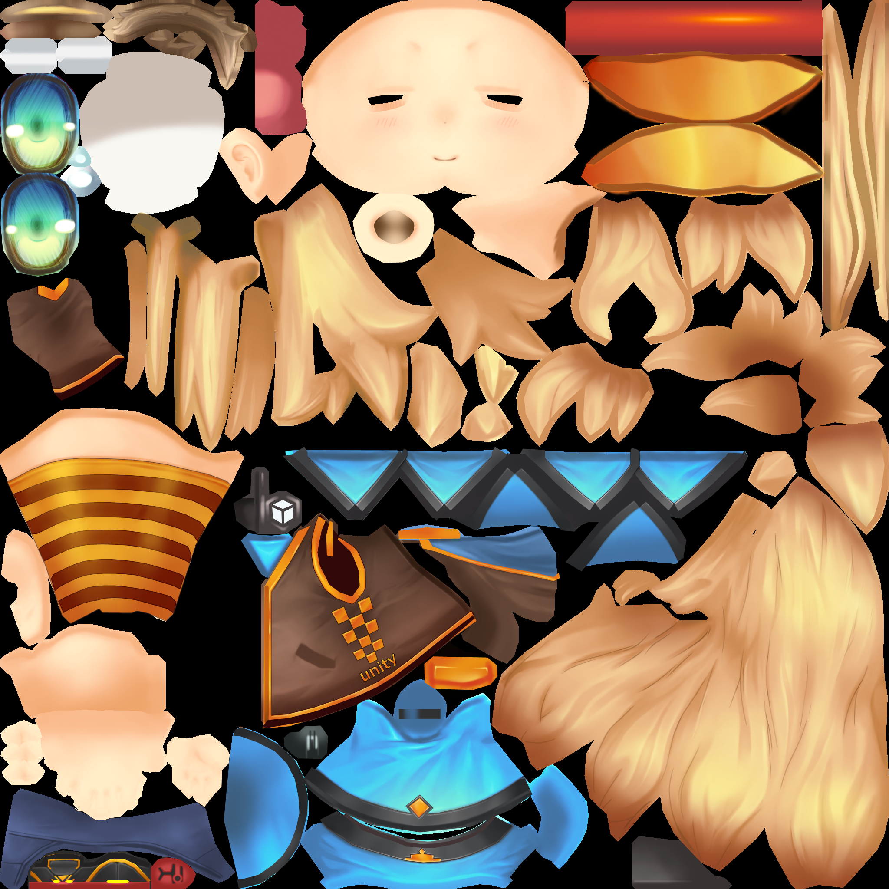</img></br>

#### スペキュラカラー
鏡面反射光を表すカラーです。表7.1ではbaseColorが該当します。多くのゲームエンジンでもアルベドカラーとスペキュラカラーは同じものとして扱っている場合が多いかと思います。しかし、鏡面反射光は物体の表面で反射する光なので、光が入射したサーフェイスのbaseColorをそのまま使えばいいのですが、拡散反射光は物体の内部で拡散して反射してくる光になるため、光が入射したサーフェイスの周辺のbaseColorを混ぜ合わせたカラーになります。そのため、アルベドカラー用のテクスチャとスペキュラカラー用のテクスチャを別に用意し、アルベドカラー用のテクスチャはテクスチャスペースでブラー処理を施したテクスチャを利用するという実装もあります。

#### メタリック
金属具合のことです。この考え方がこれまではなかったものなので、鏡面反射と関わってくるパラメータになります。Chapter5で鏡面反射というのは金属のようなサーフェイスで発生するものだと解説をしましたが、あれは正しい説明ではありません。鏡面反射というのは全てのサーフェイスで発生します。鏡面反射の割合が違うというだけです。ただ、金属のサーフェイスと非金属のサーフェイスでは鏡面反射カラーが変わってきます。金属のサーフェイスは物体の色を鏡面反射光として返すのですが、非金属のサーフェイスは光源のカラーを返します。このメタリックのパラメータは、鏡面反射光を物体のカラーと光源のカラーをブレンディングして、鏡面反射光を計算するときに使われるパラメータです。

#### 粗さ、滑らかさ、マイクロサーフェイスetc
物体の表面の目に見えない、小さな凸凹を表すパラメータです。このパラメータはレンダリングエンジンの実装により、粗さ、マイクロサーフェイスなどいろいろな名前が用いられています。例えば、UnityのメタリックセットアップのPBRであれば、滑らかさ(smooth)、UnrealEngine4であれば粗さ(Roughness)となります。ここで重要なのが、実装によってパラメータの意味が異なってくるという点です。例えば、何かのエンジンのPBRマテリアルsmoothのパラメータが0.7になっているものを、別のエンジンに持っていく場合は1-smoothの計算を行って、粗さ0.3にしてやる必要があるかもしれません。エンジンを変更する場合は、そのエンジンのPBRのワークフローについて把握している必要があります。

### 7.2.2 PBRのワークフロー
UnityやUnrealEngine等の既存のエンジンのPBRを利用するときに、PBRのワークフローについて把握しておくことは重要です。使用しているエンジンによって、PBRに必要なパラメーターやテクスチャの作り方は異なってきます。例えば、Unityのメタリックワークフローの場合、PBRに関するパラメータは次の3つになります。</br>
1. アルベドカラー
2. メタリック
3. 滑らかさ

また、メタリックと滑らかさはテクスチャとして用意することもできるのですが、この二つのパラメータは1つのテクスチャにまとめられます。メタリックはRチャンネル、滑らかさはαチャンネルを利用します。GBチャンネルは利用されません。
UnrealEngineであれば、PBRに関するパラメータは次の4つになります。</br>
1. ベースカラー
2. メタリック
3. 粗さ
4. スペキュラ

当然パラメーターをテクスチャに書きこむ場合も、どのようにテクスチャに記録するのか？という点はUnityと異なってきます。使用しているエンジンのPBRのワークフローについて理解できていないと、効果的な絵作りはできません。また、エンジンを変更する場合も、移行先のエンジンのPBRのワークフローを把握していないと、PBRパラメーターを書きこんだテクスチャを適切に移植することができません。

<note>
UnityのメタリックモードとUnrealEngine4のPBRワークフローに関するページを紹介します。</br>
https://docs.unity3d.com/ja/2018.4/Manual/StandardShaderMaterialParameterMetallic.html
https://docs.unrealengine.com/ja/RenderingAndGraphics/Materials/PhysicallyBased/index.html
</note>

### 7.2.3 【ハンズオン】シンプル Disney Based PBRを実装
では、ディズニーが発表したPBRを参考に、本書独自のシンプルなPBRを実装していきす。今回のハンズオンでは、拡散反射は正規化ランバート拡散反射とフレネル拡散反射を合成した実装、鏡面反射はクックトランスモデルを使って実装していきます。また、本書で実装するPBRのワークフローはUnityのメタリックモードのワークフローに準拠します。`Sample_07_02/Sample_07_02.sln`を立ち上げてください。

#### step-1 アルベドマップ、法線マップ、メタリックスムースマップにアクセスするための変数を追加。
まず、シェーダー側にPBR用のパラメターにアクセスするための変数を追加しましょう。今回PBRで使用するパラメータは全てテクスチャとしてグラフィックメモリに送られていいます。Assets/shader/sample.fxの58行目にリスト7.2のプログラムを入力してください。</br>
[リスト7.2 `sample.fx`]
```cpp
//step-1 アルベドマップ、法線マップ、スペキュラマップにアクセスするための変数を追加。
Texture2D<float4> g_albedo : register(t0);      	 // アルベドマップ
Texture2D<float4> g_normalMap : register(t1);   	 // 法線マップ
Texture2D<float4> g_metaricSmoothMap : register(t2); // メタリックスムースマップ。rにメタリック、aに滑らかさ。
```

#### step-2 アルベドカラー、スペキュラカラー、金属度、滑らかさをサンプリングする。
続いて、ピクセルシェーダーを改造していきます。アルベドカラー、スペキュラカラー、金属度、滑らかさをサンプリングする処理を実装しましょう。リスト7.3のプログラムを入力してください。</br>
[リスト7.3 `sample.fx`]
```cpp
// step-2 アルベドカラー、スペキュラカラー、金属度、滑らかさをサンプリングする。
// アルベドカラー（拡散反射光）
float4 albedoColor = g_albedo.Sample(g_sampler, psIn.uv);

// スペキュラカラーはアルベドカラーと同じにする。
float3 specColor = albedoColor;

// 金属度
float metaric = g_metaricSmoothMap.Sample(g_sampler, psIn.uv).r;

// 滑らかさ
float smooth = g_metaricSmoothMap.Sample(g_sampler, psIn.uv).a;
```

#### step-3 シンプルなディズニーベースの拡散反射を実装する。
続いて、ディズニーの論文を参考にした拡散反射を実装していきます。ディズニーの論文で発表されたの拡散反射は、「ランバート拡散反射」と「フレネル反射を考慮した拡散反射」を乗算で合成していました。では、フレネル反射の計算式の詳細ついては置いておいて、ランバート拡散反射とフレネル反射を考慮した拡散反射を合成するプログラムを実装しましょう。リスト7.4のプログラムを入力してください。</br>


[リスト7.4 `sample.fx` ]
```cpp
// step-3 シンプルなディズニーベースの拡散反射を実装する。
// フレネル反射を考慮した拡散反射を計算
float diffuseFromFresnel = CalcDiffuseFromFresnel(
	normal, -directionalLight[ligNo].direction, toEye);

// 正規化Lambert拡散反射を求める
float NdotL = saturate(dot(normal, -directionalLight[ligNo].direction));
float3 lambertDiffuse = directionalLight[ligNo].color * NdotL / PI;

// 最終的な拡散反射光を計算する
float3 diffuse = albedoColor * diffuseFromFresnel * lambertDiffuse;
```
やっていることは、CalcDiffuseFromFresnel()で計算した結果と、正規化ランバート拡散反射の結果を掛け算しているだけです。

#### step-4 フレネル反射を考慮した拡散反射光を求める。
続いて、先ほど利用したCalcDiffuseFromFresnel()の中身を実装していきましょう。今回実装する拡散反射はディズニーの論文に記載されていたフレネル反射による拡散反射の計算式から、「フレネル反射率が低いときに拡散反射率が高くなる」という考えだけに着目したシンプルなものです。
フレネル反射というのは、いわゆる鏡面反射のことなのですが、実はフレネル反射には下記のような性質があります。</br>

**フレネル反射は光のサーフェイスへの入射角度が大きくなっていくと、反射率が上がる**</br>
図7.5を見てみてください。</br>
**図7.5**</br>
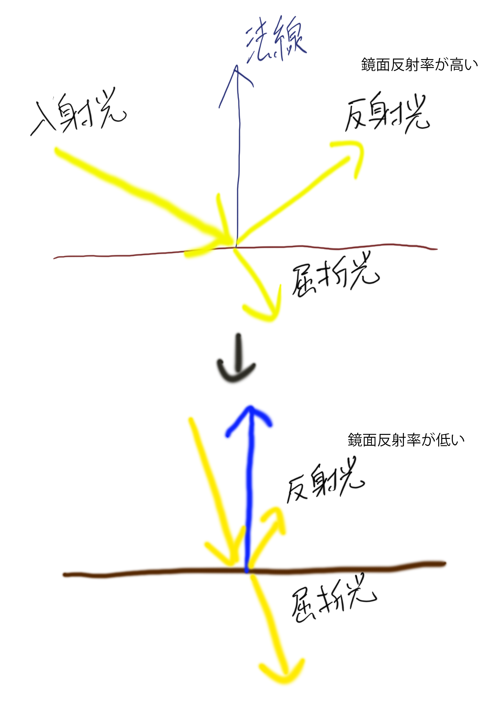</img></br>

つまり、逆に考えると、フレネル反射が弱いということは、物体内部に侵入する光が多くなるめ、内部で拡散する拡散反射が強くなります。「フレネル反射が弱くなれば、拡散反射が強くなる」というのが考え方の基本です。つまり、最も拡散反射が強くなるのは光がサーフェイスに垂直に入射しているときです(図7.6)。</br>

**図7.6**</br>
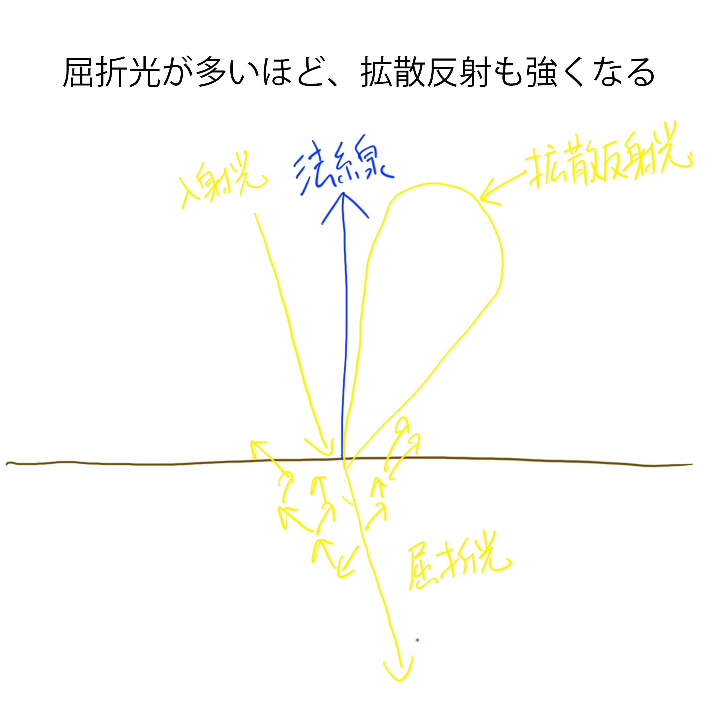</img></br>
光がサーフェイスに垂直に入射しているときが一番強く拡散反射が強いことが分かりました。では、今度は目の位置について考えていきます。光が強く見えるのは目に反射した光が多く入ってくる場合です。では、拡散反射が一番強く目に飛び込んでくるのはどういうケースでしょうか？それは、サーフェイスから目までのベクトルと、光の入射ベクトルが同じ時に最も多くの光が目に飛び込んできます。つまり、拡散反射がもっとも強くなるのは、「光の入射ベクトル、サーフェイスの法線、そして目までのベクトルの向きが同じ時」ということになります(図7.7)。</br>

**図7.7**</br>
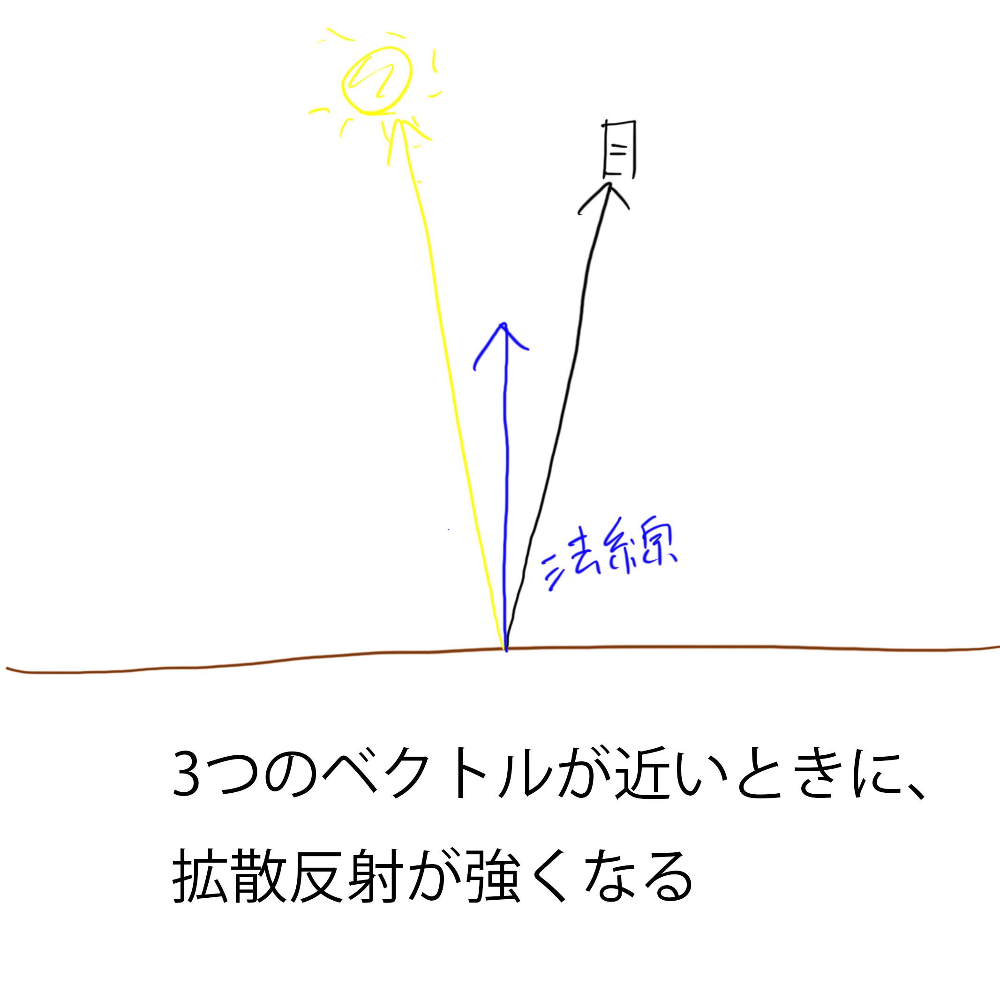</img></br>

ここまでを踏まえて、リスト7.5のプログラムを入力してください。</br>

[リスト7.5 `sample.fx`]
```cpp
// step-4 フレネル反射を考慮した拡散反射光を求める

// 法線と光源に向かうベクトルがどれだけ似ているかを内積で求める
float dotNL = saturate(dot(N,L));

// 法線と視線に向かうベクトルがどれだけ似ているかを内積で求める
float dotNV = saturate(dot(N,V));

// 法線と光源への方向に依存する拡散反射率と、法線と視点ベクトルに依存する拡散反射率を
// 乗算して最終的な拡散反射率を求めている。
return dotNL*dotNV;

```

#### step-5 クックトランスモデルを利用した鏡面反射率を計算する。
続いて、鏡面反射を計算していきます。鏡面反射の計算にはクックトランスモデルを利用しています。しかし、今回はクックトランスモデルの中身については説明は行いません。クックトランスに関してはwebなどに豊富に説明があるので、そちらを参照してもらえたらと思います。今回は金属度の使い方に焦点をあてて解説します。では、リスト7.6のプログラムを入力してください。</br>
[リスト7.6 `sample.fx`]
```cpp
// step-5 クックトランスモデルを利用した鏡面反射率を計算する
// クックトランスモデルの鏡面反射率を計算する
float3 spec = CookTorranceSpecular(
	-directionalLight[ligNo].direction, toEye, normal, smooth)
	* directionalLight[ligNo].color;

// 金属度が高ければ、鏡面反射はスペキュラカラー、低ければ白
// スペキュラカラーの強さを鏡面反射率として扱う
spec *= lerp( float3( 1.0f, 1.0f, 1.0f), specColor, metaric);
```

スペキュラ反射というのは金属だけではなく全ての物体で発生します。しかし、金属と非金属のスペキュラ反射には下記のような違いがあります。
**「金属性の高いサーフェイスのスペキュラ反射には色がつく」**
逆に金属性が低いサーフェイスのスペキュラ反射は色がつかず、白っぽいスペキュラ反射になります。今回のプログラムでは次のように、メタリック度を利用して、スペキュラ反射のカラーを決定しています。

```cpp
// 金属度が高ければ、鏡面反射はスペキュラカラー、低ければ白
// スペキュラカラーの強さを鏡面反射率として扱う
spec *= lerp( float3( 1.0f, 1.0f, 1.0f), specColor, metaric);
```

#### step-6 鏡面反射率を使って、拡散反射光と鏡面反射光を合成する。
では、これで最後です。鏡面反射率を使って、拡散反射光と鏡面反射光を合成しましょう。リスト7.7のプログラムを入力してください。</br>
[リスト7.7 `sample.fx`]
```cpp
// step-6 滑らかさを使って、拡散反射光と鏡面反射光を合成する
// 滑らかさが高ければ、拡散反射は弱くなる
lig += diffuse * (1.0f - smooth) + spec;
```
ここまで実行できたらプログラムを入力してください。図7.8のようなプログラムが実行できていたら完成です。ゲームコントローラーの右スティックでカメラの回転、左スティックでライトの回転、Ａボタンを押すとモデルを変更することができます。</br>

**図7.8**</br>
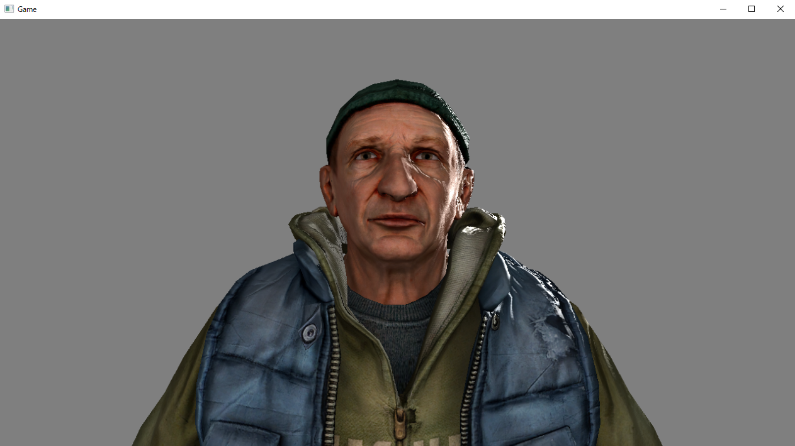</img></br>

### 7.2.4 ディズニーベースのフレネル反射による拡散反射を真面目に考察する
さて、先ほどのハンズオンでは、ディズニーが発表したフレネル反射による拡散反射の一部の側面を、かなり簡略化した計算で実装しました。しかし、実際に発表された論文に記載されていた計算式は次のように、もう少し複雑なものでした。</br>
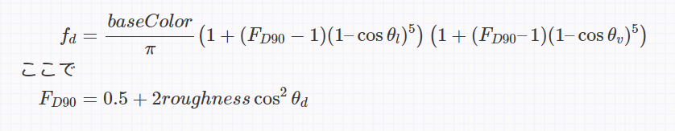</img></br>
この計算式は、次のように分解できます。</br>
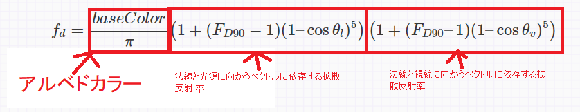</img></br>
見てもらえば分かるように、前節で実装した簡略化した実装に登場していた、「法線と光源に向かうベクトルに依存する拡散反射率」と「法線と視線に向かうベクトルに依存する拡散反射率」をアルベドカラーに乗算しています。πで除算しているのは正規化を行うためです。では、この反射率の計算方法について考えていきましょう。

#### 法線と光源に向かうベクトルに依存する拡散反射率
「法線と光源に向かうベクトルに依存する拡散反射率」の計算は次の部分にあたります。</br>
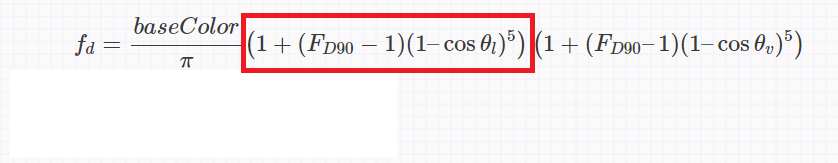</img></br>
では、この計算式が何を意味しているのか見ていきましょう。まず、1の項は光がサーフェイスに垂直に入射してきたときの拡散反射率です。</br>
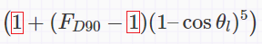</img></br>
光がサーフェイスに垂直に入射してきた場合は、内部に侵入する光の量が大きくなるため、拡散反射する光の量が増えます。なので、拡散反射率は1.0(100%)としています。</br>続いて、Fd90は光がサーフェイスに対してほぼ平行で入射してきたときの拡散反射率です。</br>
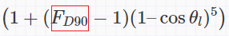</img></br>

この値については、後でもう少し詳細に解説しますが、これまでの説明では、光がサーフェイスに対して、ほぼ並行で入射してきたときは、鏡面反射の割合が増えるため、拡散反射の割合が低くなると説明してきました。ですので、このFd90は通常1より小さい数値が入ります(実はこのFd90の値が前節のシンプルな実装との大きな違いになってくるのですが、ここではFd90に0.5程度の数値が入っているものとして考えておきましょう)。</br>
続いて、cosθlですが、これは法線と光源に向かって伸びるベクトルの内積です。</br>
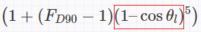</img></br>
この計算式の重要な要素について説明が終わったので、この計算が何をしているのか解説します。この計算式は、「光がサーフェイスに垂直に入射したときの拡散反射率」と、「光がサーフェイスに平行に入射したときの拡散反射率」を、「法線と光源に向かって伸びるベクトルの内積の値」を使って、線形補完している計算式です。プログラムで記述したほうが分かりやすい人もいるかと思いますので、この計算式が行っていることをプログラムで示します。</br>

```cpp
//法線をN、光源へのベクトルをLとする。
float f0 = 1.0f;	//光がサーフェイスに垂直に入射したときの拡散反射率
float f90 = 0.5f;	//光がサーフェイスに平行に入射したときの拡散反射率
//法線と光源へのベクトルとの内積を計算する。
float t = dot( N, L );
//法線と光源が離れていくと、1に近づいていくように反転させる。
t = 1.0f - t;
//反射率を線形補間。
//補間率は5乗している。
float diffuseRate = lerp( f0, f90, pow( t, 5.0f ) );
```

やっていることは、法線と光源に向かうベクトルが離れていくと、拡散反射率が弱いf90の反射率に線形補間しているだけです。補間率を5乗しているのは、現実世界の現象は、指数関数的な変化をするからです。さて、「法線と視線に向かうベクトルに依存する拡散反射率」についてはもう解説の必要はないでしょう。これは、ここで解説した「法線と光源に向かうベクトルに依存する拡散反射率」の考え方と全く同じです。内積を計算するベクトルが変わるだけですね。
</img></br>

#### Fd90の値
さて、最後にFd90の値について正しく説明しておきます。実はFd90の値は必ずしも1より小さな数値になるわけではなく、最大で1より大きい2.5の数値になる計算になっています。</br>
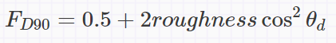</img></br>
これがシンプルな実装と大きく意味合いが変わってくるケースで、本来は、光がサーフェイスに光が平行に入射してくるときは、鏡面反射率が高くなるため、拡散反射率は低くなるのですが、平行に入射してくるときに拡散反射率が高くなるケースが想定されています。これがどのようなケースかというと、サーフェイスの微小面での粗さが大きくなってきている時です。サーフェイスが粗くなっていると、光は鏡面反射したとしても表面で拡散して反射してしまうため、それを考慮した計算式となっているわけです。

### 7.2.6 【ハンズオン】ディズニーベースのフレネル反射による拡散反射を真面目に実装する。
では、ディズニーべースのフレネル反射による拡散反射を真面目に実装してみましょう。Sample_07_03/Sample_07_03.slnを開いてください。
#### step-1 ディズニーベースのフレネル反射による拡散反射を真面目に実装する。

では、Assets/shader/sample.fxを開いてリスト7.8のプログラムを入力してください。なお、今回の実装はSIGGRAPH 2014でEA DICEが発表した、改良コードが含まれています。</br>
[リスト7.8 sample.fx]
```cpp
// step-1 ディズニーベースのフレネル反射による拡散反射を真面目に実装する。
// 光源に向かうベクトルと視線に向かうベクトルのハーフベクトルを求める
float3 H = normalize(L+V);

//粗さは0.5で固定。
float roughness = 0.5f;

//これはEA DICEが発表した改良コード。
float energyBias = lerp(0.0f, 0.5f, roughness);
float energyFactor = lerp(1.0, 1.0/1.51, roughness);

// 光源に向かうベクトルとハーフベクトルがどれだけ似ているかを内積で求める
float dotLH = saturate(dot(L,H));
// 光源に向かうベクトルとハーフベクトル、光が平行に入射したときの拡散反射量を求めている。
float Fd90 = energyBias + 2.0 * dotLH * dotLH * roughness;

// 法線と光源に向かうベクトルを利用して拡散反射率を求めています
float dotNL = saturate(dot(N,L));
float FL = (1 + (Fd90 - 1) * pow(1 - dotNL, 5));


// 法線と視点に向かうベクトルを利用して拡散反射率を求めています
float dotNV = saturate(dot(N,V));
float FV =  (1 + (Fd90 - 1) * pow(1 - dotNV, 5));

//法線と光源への方向に依存する拡散反射率と、法線と視点ベクトルに依存する拡散反射率を
// 乗算して最終的な拡散反射率を求めている。
return (FL*FV * energyFactor);
```

実装出来たら実行してみてください。分かりにくいかもしれませんが、シンプルな実装のPBRと異なり、フレネル反射が強い位置関係のサーフェイスでも拡散反射が強く出るようになっています。

<note>
ディズニーが発表した拡散反射は射出エネルギーの総量が放出エネルギーの総量を超えており、エネルギー保存則を満たしていませんでした。この問題を解決したのがEA DICEが発表した改良版のコードです。この発表の内容のURLを記載しますので、興味のある方は是非参照してみてください。
https://seblagarde.files.wordpress.com/2015/07/course_notes_moving_frostbite_to_pbr_v32.pdf
</note>