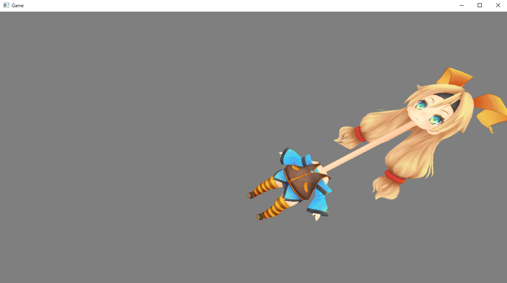
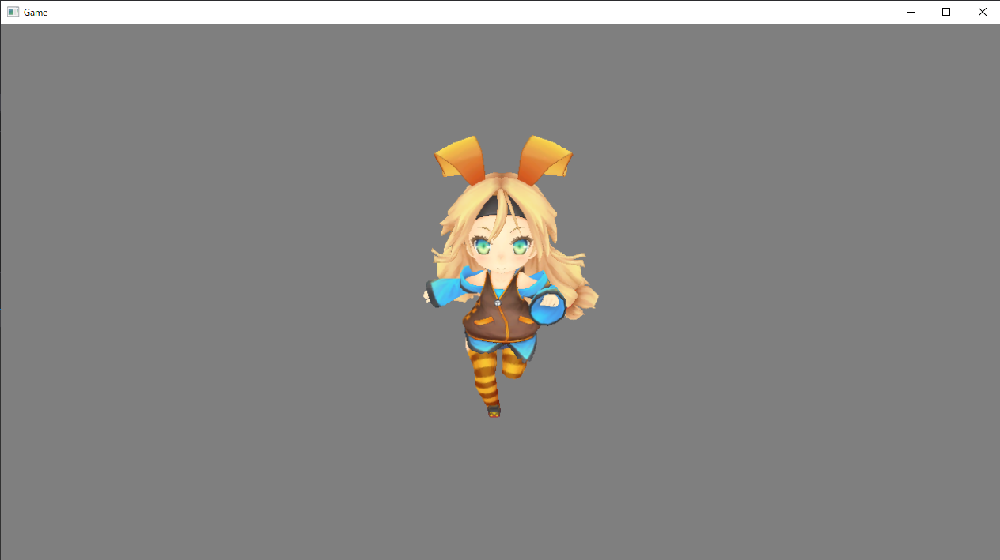

## はじめに
このチャプターでは、現在のキャラクターアニメーションのデファクトスタンダードである、スキンアニメーションの仕組みについて勉強していきます。

---
## Opt.4.1 概要
&emsp;スキンアニメーションとはスケルトンと呼ばれる骨情報を使って、キャラクターをアニメーションさせる手法です。スケルトンは骨の集合で、その骨を動かすことで、キャラクターをアニメーションさせることができます。スキンアニメーションで扱う、アニメーションデータは、各キーフレームごとに、スケルトンの骨の位置、回転、拡大率を記憶しているデータです。このアニメーション手法のことを、キーフレームアニメションといいます。３Ｄモデルの頂点には、どの骨の影響を受けるのかという情報が埋め込まれています。例えば、前腕の頂点には、影響をうける前腕の骨の番号が埋め込まれています。では、以降ではこれらについて、詳細に解説をしていきます。

## Opt.4.2 スケルトン
&emsp;スケルトンはボーン(骨)の配列です。ボーンは、その骨の位置、回転、拡大情報を保持しています。そしてスケルトンはボーンの配列です。プログラム的には次のようなデータ構造になります。

```cpp
// ボーン。
struct Bone{
	Vector3 position;		// 位置。
	Quaternion rotation;	// 回転。
	Vecto3 scale;			// 拡大率。
};
// スケルトン。
struct Skeleton{
	std::vector<Bone>	boneArray;	// 骨の配列。
};
```

&emsp;スケルトンは3dsMaxやMayaなどのDCCツールで作成します。図Opt4.1はUnityちゃんのスケルトンです。</br>
**図Opt4.1 3dsMax**
</br>
&emsp;DCCツールで作成された、スケルトンデータはゲーム中に利用されるので、ゲームで扱える形式で出力する必要があります。本校のエンジンにはtksファイルというスケルトンデータが用意されています。このデータは、3dsMaxでスキンモディファイアが設定されている、モデルデータを、tkExporterを利用して、tkmファイルを保存することで、自動的に出力されています。スキンアニメーションを行うためには、まずこのスケルトンデータをロードして、アニメーションさせたいモデルとバインドさせる必要があります。

## Opt4.3 【ハンズオン】ろくろ首ユニティちゃん　その１～スケルトンとモデルとバインドさせて、骨を動かしてみよう～
&emsp;さて、スケルトンの詳細な説明をする前に、とりあえず、手を動かしてスケルトンのイメージをつかんでみましょう。ここまでに説明してきたように、スケルトンとモデルをバインドさせることができたら、骨を動かすことで、キャラクターをアニメーションさせることができます。この骨を動かす情報が記憶されているのが、アニメーションデータなのですが、アニメーションデータがなくても骨を動かすことはできます。このハンズオンでは、Optional_04_01を使って、ゲームコントローラーの操作で、ユニティちゃんの首の骨を動かして、ろくろ首ユニティちゃんを作ってみましょう。では、Optional_04_01/Optional_04_01.slnを立ち上げてください。

### step-1 スケルトンデータをロードする。
&emsp;まずは、スケルトンデータをロードする必要があります。本書にはスケルトンを扱うためのSkeletonクラスが用意されています。このクラスを利用して、スケルトンデータをロードしましょう。main.cppにリスト-O4.1のコードを入力してください。</br>
[リスト-O4.1 main.cpp]
```cpp
// step-1 スケルトンデータをロードする。
Skeleton skeleton;
skeleton.Init("Assets/modelData/unityChan.tks");
```
Skeleton::Init()関数に指定した、unityChan.tksというファイルがスケルトンデータです。ファイル名を間違えないように気を付けて下さい。

### step-2 モデルデータをロードして、スケルトンと関連付けする。
&emsp;続いて、モデルデータをロードして、スケルトンと関連付けしましょう。リスト-O4.2のコードを入力してください。</br>
[リスト-O4.2 main.cpp]
```cpp
// step-2 モデルデータをロードして、スケルトンと関連付けする。
ModelInitData modelInitData;
// tkmファイルのファイルパスを指定する。
modelInitData.m_tkmFilePath = "Assets/modelData/unityChan.tkm";
// シェーダーファイルのファイルパスを指定する。
modelInitData.m_fxFilePath = "Assets/shader/model.fx";
// ノンスキンメッシュ用の頂点シェーダーのエントリーポイントを指定する。
modelInitData.m_vsEntryPointFunc = "VSMain";
//【注目】スキンメッシュ用の頂点シェーダーのエントリーポイントを指定。
modelInitData.m_vsSkinEntryPointFunc = "VSSkinMain";
//【注目】スケルトンを指定する。
modelInitData.m_skeleton = &skeleton;

// 初期化情報を使って、モデルを初期化。
Model model;
model.Init(modelInitData);
```
&emsp;モデル初期化情報に、step-1でロードした、スケルトンのアドレスを指定していることに注目してください。これで、モデルとスケルトンの関連付けが行われます。</br>
&emsp;また、もう一点、スキンメッシュ用の頂点シェーダーのエントリーポイントを指定している箇所にも注目してください。ここでは、まだ詳細は説明しませんが、スケルトンを使って、モデルを動かすには、専用の頂点シェーダーを作成する必要があります。今回は私の方で用意していますので、皆さんが実装することはありませんが、スケルトンを利用して、3Dモデルを動かすためには、スケルトンを利用した座標変換を行う頂点シェーダーを作成する必要があるということだけ、覚えておいてください。

### step-3 コントローラーの入力で頭の骨を動かす。
&emsp;ここからはゲームループの処理です。ゲームコントローラーの入力で骨を動かすプログラムを実装しましょう。リスト-O4.3のプログラムを入力してください。</br>
[リスト-O4.3]
```cpp
// step-3 コントローラーの入力で頭の骨を動かす。
// 骨の名前でボーンIDを検索する。
int boneId = skeleton.FindBoneID(L"Character1_Neck");
// 検索したボーンIDを使って、ボーンを取得する。
Bone* bone = skeleton.GetBone(boneId);
// ボーンのローカル行列を取得する。
Matrix boneMatrix = bone->GetLocalMatrix();
// コントローラーを使って、ローカル行列の平行移動成分を変化させる。
boneMatrix.m[3][0] -= g_pad[0]->GetLStickXF();
boneMatrix.m[3][1] += g_pad[0]->GetLStickYF();
// 変更したボーン行列を設定する。
bone->SetLocalMatrix(boneMatrix);
```
&emsp;ここで、操作しているボーンの情報が行列であることに注意してください。こちらも詳細は後述しますが、最終的にボーンの情報は頂点シェーダーに送られて、頂点の座標変換で利用されます。頂点シェーダーで座標変換は、頂点座標に行列を乗算することで行えました。ですので、ボーンの位置、回転、拡大などの情報も行列でGPUに送る必要があります。行列の3行目の成分は平行移動成分なので、ここでは直接行列をいじって、骨を動かしています。ここで動かしてるボーンは親の座標系での行列です。
### step-4 スケルトンを更新する。
&emsp;続いて、スケルトンを更新します。step-3でボーンの行列を動かしましたが、実はあの行列は最終的にGPUに送られる行列ではありません。Skeleton::Update()関数を呼び出すことで、最終的にGPUに送られるボーン行列が計算されます。リスト-O4.4のプログラムを入力してください。</br>
[リスト-O4.4]
```cpp
// step-4 スケルトンを更新する。
// Skeleton::Update()関数の中で、ワールド行列を計算している。
skeleton.Update(model.GetWorldMatrix());
```

### step-5 モデルをドロー。
&emsp;最後にモデルをドローするいつものコードを書きましょう。リスト-O4.5のプログラムを入力してください。</br>
[リスト-O4.5]
```cpp
// step-5 モデルをドロー。
model.Draw(renderContext);
```

&emsp;入力出来たら実行してみてください。正しく実装できていると、ゲームコントローラの左スティックを使って、ユニティちゃんの首を動かすことができます。

## Opt4.4 ローカル行列とワールド行列
&emsp;ボーンは位置、回転、拡大を表す情報として、行列を保持しています。行列を保持している理由は、先ほど説明したように、最終的にGPUで座標変換を行う場合に、行列が必要になるからです。しかし、ボーンが保持している行列は一つだけではありません。ここでは、その中でも特に重要な「ローカル行列」と「ワールド行列」について解説していきます。ワールド行列は分かりやすいと思います。イメージ通り、ボーンのワールド空間上での位置、回転、拡大を表す行列です。最終的にGPUに送られて頂点シェーダーで利用される行列です。では、「ローカル行列」とはいったい何なのでしょうか。ここでのローカル行列は「親のボーン座標系での行列」を指しています。この後詳しく勉強するキーフレームアニメーションデータには、時間ごとの各ボーンの位置、回転、拡大率の情報が記憶されています。つまり、行列が記憶されているのですが、ここで記憶されている行列は、ワールド行列ではなく、親のボーン座標系での行列、つまりローカル行列です。スケルトンは親子関係を持っている階層構造のデータです。例えば、前腕の骨の親は上腕の骨になります。親子関係のあるデータは親が動くと子供が動きます。上腕の骨を動かすと前腕の骨が動きますよね。親のボーンの座標系というのは、親のボーンを原点とする空間のことです。例えば、前腕の骨の親は上腕の骨となるため、前腕の骨のローカル行列は、上腕の骨を原点とした座標系の行列です。</br>
&emsp;では、なぜローカル行列を使うのか。結論を端的にいうと、親の座標系で動かした方が、扱いやすいことが多いからです。例えば、ワンピースのルフィを扱ったゲームを作っていることを考えてみてください。ルフィはゴムゴムの実を食べたゴム人間なので、腕を伸ばすことができます。このような処理を実装したい場合、まさに、骨を利用して、腕を伸ばすのですが、では前腕の腕を、腕を伸ばしている方向に伸ばしたいとします。このとき、骨をワールド空間で扱うと、腕を伸ばす方向はルフィの回転、腕をどこに伸ばしているかということを考慮する必要が出てきて、プログラムが複雑になってしまいます。しかし、ローカル座標系で考えれば、そんなことは気にする必要がなくなります。このような要因から、親子構造のデータを扱う場合は、ローカル座標系で考えた方がプログラム的に扱いやすくなるのです。

## Opt4.5 【ハンズオン】ろくろ首ユニティちゃん　その2 ～ローカル座標系で考えた方が簡単って本当？～
&emsp;では、本当にローカル座標系でプログラムを作成したほうが簡単なのか、実際にプログラムを書いて確認してみましょう。これから、皆さんが次のような仕様をゲームに組み込むと考えてください。</br>
**「ゲームコントローラーの入力すると、ユニティちゃんの首を上に伸ばすことができる」**</br>
&emsp;では、Optional_04_02/Optional_04_02.slnを開いて、F5を押してゲームを実行してみてください。すると図4.2のようなプログラムを実行することができます。
</br>
&emsp;このプログラムはコントローラーの右スティックの入力でユニティちゃんを回転させることができます。試しに回転させてみてください。</br>
&emsp;さて、今回実装する必要のある、ユニティちゃんの首を上に伸ばすことができるという仕様は、ユニティちゃんの向きに関わらず、ユニティちゃんにとっての上方向に伸ばすことができるというものです。ワールド空間の上方向ではないことに注意してください。伸ばしたいのは、ユニティちゃんにとっての上方向です。つまり、図4.3のように首を伸ばしたいわけです。</br>
</br>

### step-1 コントローラーの入力で頭の骨を上下に動かす。
&emsp;では、ユニティちゃんの首を上下に動かすプログラムを実装していきましょう。このサンプルプログラムでは、スケルトンのロードや関連付けはすでに終わっているので、首を伸ばすプログラムを追加するだけです。main.cppの該当するコメントの箇所にリスト-O4.6のプログラムを入力してください。</br>
[リスト-O4.6]
```cpp
// step-1 コントローラーの入力で頭の骨を上下に動かす。
// 骨の名前でボーンIDを検索する。
int boneId = skeleton.FindBoneID(L"Character1_Neck");
// 検索したボーンIDを使って、ボーンを取得する。
Bone* bone = skeleton.GetBone(boneId);
// ボーンのローカル行列を取得する。
Matrix boneMatrix = bone->GetLocalMatrix();
// 【注目】コントローラーを使って、ローカル行列のZ方向の平行移動成分を変化させる。
// なんでZが上なの？ユニティちゃんはz-upで作られているから。
boneMatrix.m[3][2] += g_pad[0]->GetLStickYF();
// 変更したボーン行列を設定する。
bone->SetLocalMatrix(boneMatrix);
```
&emsp;さて、やっていることはOpt4.3のハンズオンでやっていることと大差ありません。注目してほしいのは、ユニティちゃんのローカル行列のZ成分を変化させているところです。ユニティちゃんはZ-upで作成されているので、ローカル行列のZ方向の平行移動成分を変化させているのですが、重要なのはそこではありません。重要なのは、ユニティちゃんの頭を上下に動かす際に、ユニティちゃんがワールド空間でどんな姿勢になっているかなど、考える必要がなく、ユニティちゃんにとっての上方向のみを操作すればいいということです。これは、ローカル座標系で操作することができるからです。もし、ローカル座標系でコードを書くことができない場合は、ユニティちゃんにとっての上方向がワールド座標系で、どうなっているのかを、図4.4のように計算する必要があります。</br>
</br>

## Opt4.6 ワールド行列の計算
&emsp;さて、アニメーションのしやすさや、動かしやすさから、cpp側ではボーンの行列はローカル行列で扱われるのですが、最終的にGPUに送るときはワールド行列になっている必要があります。このローカル行列からワールド行列を計算しているのが、Skeleton::Update()関数です。</br>
&emsp;では、ローカル行列からワールド行列はどのように計算されるのでしょうか。答えは、スケルトンのルートボーン(最上位の親)から子供に向かって、ローカル行列を掛け算していって、最終的なワールド行列を求めます。例えば、図Opt4.5のような階層構造を持っているボーンAのワールド行列を計算する場合は、図Opt4.6のような計算を行います。</br>
</br>
</br>

&emsp;では、この処理をもう少し分かりやすく解説します。話を簡単にするために、平行移動についてのみ考えてみようと思います。図Opt4.7を見て下さい。</br>
</br>
&emsp;この図の場合、ツボのワールド座標は下記の計算で求まります。</br>
ツボのワールド座標 = リンクのワールド座標＋ツボのローカル座標 = (５,９,７)</br>
&emsp;では、これを行列で考えてみましょう。行列は行列同士の乗算を行うことで、行列を合成することができました。上の図では、リンクのワールド行列(ワールド空間で5,4,7、平行移動する行列とツボのローカル行列(親の座標系で0,5,0、平行移動する行列)を乗算すると、(5,9,7)となり、平行移動する行列が求まります。いかがでしょうか、先ほど計算した、ツボのワールド座標と同じになりましたね。ボーンのワールド行列を求めるときの式は、親から子に向かって行列を乗算することで、このような計算を行っていたのです。</br>

## 評価テスト4-1
次の評価テストを行いなさい。</br>
[評価テストへジャンプ](https://docs.google.com/forms/d/e/1FAIpQLSdr7IUAHZZ-LFigneITGo_a2bZXGKTGJ8JDRQuTRU58oYmejA/viewform?usp=sf_link)

<!-- 改ページ. -->
<div style="page-break-before:always"></div>

## Opt4.7 キーフレームアニメーション
&emsp;さて、ここからは3dsMaxなどのCGツールで作成したアニメーションデータを使って、キャラクターをアニメーションさせる仕組みについてみていきましょう。</br>
&emsp;ここまでの内容で、ボーンのローカル行列を動かすことで、3Dモデルの各部位を動かすことができることがわかりました。キャラクターアニメーションというのも、ボーンのローカル行列を動かすことで、実現することができます。このキャラクターをアニメーションさせるデータのことをアニメーションクリップなどと呼称します。アニメーションクリップデータには、各フレームごととの骨のローカル空間での座標、回転、拡大率が記録されています。ゲームでは、アーティストが作成したアニメーションクリップデータをロードして、各フレームのローカル行列の情報をアニメーションクリップからサンプリングして、ローカル行列を計算して、その行列を該当するボーンのローカル行列にコピーすることで、キャラクターをアニメーションさせることができます。リスト-O4.7のコードは本書のMiniEngineに付属しているAnimation.cppのプログラムの一部です。アニメーションクリップからサンプリングしてきた情報を使って、ボーンのローカル行列を計算しています。</br>
[リスト-O4.7]
```cpp
// vGlobalScale、qGlobalPose、vGlobalPoseがアニメーションクリップから
// サンプリングしてきた情報。これらをもとにローカル行列を計算している。

// グローバルポーズをスケルトンに反映させていく。
for (int boneNo = 0; boneNo < numBone; boneNo++) {
		
	// 拡大行列を作成。
	Matrix scaleMatrix;
	scaleMatrix.MakeScaling(vGlobalScale[boneNo]);
	// 回転行列を作成。
	Matrix rotMatrix;
	rotMatrix.MakeRotationFromQuaternion(qGlobalPose[boneNo]);
	// 平行移動行列を作成。
	Matrix transMat;
	transMat.MakeTranslation(vGlobalPose[boneNo]);

	// 全部を合成して、ボーン行列を作成。
	Matrix boneMatrix;
	boneMatrix = scaleMatrix * rotMatrix;
	boneMatrix = boneMatrix * transMat;
		
	m_skeleton->SetBoneLocalMatrix(
		boneNo,
		boneMatrix
	);				
}
```
&emsp;このような、各キーフレームのボーンの位置情報を使って、キャラクターをアニメーションさせる手法のことを、キーフレームアニメーションといいます。
### Opt4.7.1 フルキーフレームアニメーションとキーフレーム補間アニメーション
&emsp;キーフレーム法のアニメーション手法には、大きく分けて、二つの種類があって、「フルキーフレームアニメーション」と「キーフレーム補間アニメーション」があります。フルキーフレームアニメーションは、すべてのフレームで、ボーンの位置、回転、拡大率を出力して、そのデータを利用する手法です。この手法はアニメーションプログラムの実装がシンプルになります。現在再生中のアニメーションフレーム番号をもとに、アニメーションクリップから、ボーンの位置、回転、拡大情報をサンプリングして、ローカルボーン行列を計算すればよいだけです。本書のMiniEngineに付属しているアニメーション処理は、こちらのフルキーフレームアニメーションとなります。</br>
&emsp;一方、キーフレーム補間アニメーションのプログラムは少し複雑になります。キーフレーム補間アニメーションで利用するアニメーションクリップのデータは、一部のフレームの情報しか出力されていません。例えば、1フレーム目、５フレーム目、10フレーム目、20フレーム目の情報しかないなどです。では、２フレーム目や３フレーム目などの、情報が中間フレームのアニメーションはどうするのかというと、１フレーム目と５フレーム目の情報を使って、補間して求めることになります。</br>
### Opt4.7.2 フルキーフレームアニメーションとキーフレーム補間アニメーションのメリットデメリット
&emsp;では、最後にフルキ―フレームアニメションとキーフレームアニメーションのメリットデメリットを見ていきましょう。ポイントは次の２点です。
1. アニメーションクリップデータのファイルサイズ
2. アニメーションの品質
&emsp;まず、一つ目のアニメーションクリップデータのファイルサイズですが、こちらはキーフレーム補間アニメーション方がファイルサイズが小さくなります。一部のフレームの情報しか出力されていないため、必然的にデータサイズは小さくなります。そのため、メモリ使用量などを削減することが期待できます。一方フルキーフレームアニメーションはすべてのフレームの情報を出力しているため、データサイズが大きくなり、メモリ使用量が増大することとなります。</br>
&emsp;続いて、アニメーションの品質ですが、これはフルキーフレームアニメーションの方が優れています。フルキ―アニメーションでは、すべてのキーフレームの情報がデータとして出力されているため、アーティストが作成した通りのアニメーションを流すことが可能です。一方、キーフレーム補間アニメーションでは中間フレームの情報はゲーム側の計算で求めるため、アーティストが作成したアニメーションと微妙に結果が異なるものとなってしまう可能性があります。</br>

## Opt4.8 【ハンズオン】ユニティちゃんにアニメーションを流してみよう。
&emsp;では、本書に付属しているミニエンジンのAnimationクラスとAnimationClipクラスを利用して、ユニティちゃんにアニメーションを流すプログラムを実装してみましょう。Optional_04_03/Optional_04_03.slnを開いてください。

### step-1 スケルトンデータをロードして、モデルと関連付けする
&emsp;まずは、ここまでの復習です。スケルトンデータをロードして、モデルと関連付けをしましょう。main.cppを開いて、該当のコメントの箇所にリスト-O4.8を入力してください。</br>
[リスト-O4.8]
```cpp
 // step-1 スケルトンデータをロードして、モデルと関連付けする
// スケルトンをロード。
Skeleton skeleton;
skeleton.Init("Assets/modelData/unityChan.tks");

// モデルの初期化情報を構築
ModelInitData modelInitData;
// tkmファイルのファイルパスを指定する。
modelInitData.m_tkmFilePath = "Assets/modelData/unityChan.tkm";
// シェーダーファイルのファイルパスを指定する。
modelInitData.m_fxFilePath = "Assets/shader/model.fx";
// ノンスキンメッシュ用の頂点シェーダーのエントリーポイントを指定する。
modelInitData.m_vsEntryPointFunc = "VSMain";
// スキンメッシュ用の頂点シェーダーのエントリーポイントを指定。
modelInitData.m_vsSkinEntryPointFunc = "VSSkinMain";
// ユニティちゃんはアニメーションデータでY-Upに補正されているので、
// 上方向をY-Upに変更しておく。
modelInitData.m_modelUpAxis = enModelUpAxisY;
// スケルトンを指定する。
modelInitData.m_skeleton = &skeleton;

// 初期化情報を使って、モデルを初期化。
Model model;
model.Init(modelInitData);
```

### step-2 アニメーションクリップをロードする。
&emsp;続いて、アニメーションクリップのロードです。本書のMiniEngineでは、著者オリジナルのアニメーションクリップファイルフォーマットのtkaファイルを利用することができます。AnimationClip関数を利用して、tkaファイルをロードしましょう。main.cppにリスト-O4.9のプログラムを入力してください。</br>
[リスト-O4.9]
```cpp
// step-2 アニメーションクリップをロードする。
// 今回は「走りアニメーション」と「ジャンプアニメーション」の二つのアニメーションをロードするので、
// AnimationClipの配列の要素数を２とする。
AnimationClip animClip[2];
// ジャンプアニメーションをロードする。
animClip[0].Load("Assets/animData/jump.tka");
// 走りアニメーションをロードする。
animClip[1].Load("Assets/animData/run.tka");
// 走りアニメーションはループ再生をしたいので、ループフラグをtrueにする。
animClip[1].SetLoopFlag(true);
```

### step-3 アニメーションの再生処理を初期化する。
&emsp;step-3では、アニメーションを再生させる処理を初期化します。本書のAnimationクラスのオブジェクトを初期化するためには、Animation::Init()関数を呼び出します。この関数は第一引数にアニメーションさせるスケルトン、第二引数にアニメーションクリップの配列、第三引数にアニメーションクリップの数を指定して呼び出します。では、main.cppにリスト-O4.10のプログラムを入力してください。</br>
[リスト-O4.10]
```cpp
// step-3 アニメーションの再生処理を初期化する。
Animation animation;
animation.Init(
	skeleton,       // アニメーションさせるスケルトン
	animClip,       // アニメーションクリップの配列
	2               // アニメーションクリップの数。
);
```

### step-4 コントローラーの入力で、再生するアニメーションを切り替える。
&emsp;ここからはげームループの処理です。step-4では、ゲームコントローラーの入力で、再生するアニメーションを切り替える処理を実装します。main.cppにリスト-O4.11のプログラムをにゅうりょくしてください。</br>
[リスト-O4.11]
```cpp
// step-4 コントローラーの入力で、再生するアニメーションを切り替える。
if (g_pad[0]->IsTrigger(enButtonA)) {
	// Aボタンが押されたら、ジャンプアニメーションに変更する。
	// Animation::Play()関数に引数は、再生したいアニメーションクリップの番号。
	// この番号はAnimation::Init()関数に指定した、アニメーションクリップの配列の順番と同じとなる。
	animation.Play(0);
}
if (g_pad[0]->IsTrigger(enButtonB)) {
	// Bボタンが押されたら、走りアニメーションに変更する。
	// Animation::Play()関数に引数は、再生したいアニメーションクリップの番号。
	// この番号はAnimation::Init()関数に指定した、アニメーションクリップの配列の順番と同じとなる。
	animation.Play(1);
}
```

### step-5 アニメーションの再生を進める。
&emsp;続いて、アニメーションの再生処理です。Animation::Progress()関数を呼び出すことで、アニメーションが再生されて、アニメーションクリップからサンプリングされた情報をもとに、スケルトンにボーンのローカル行列の情報が流し込まれます。Progress()関数の第一引数は、アニメーションを進める時間です。この時間の単位は秒となっています。では、リスト-O4.12のプログラムをmain.cppに入力して下さい。</br>
[リスト-O4.12]
```cpp
// step-5 アニメーションの再生を進める。
animation.Progress(1.0f / 60.0f);
```

### step-6 スケルトンを更新して、モデルをドローする
&emsp;いよいよ最後です。step-5でアニメーションクリップからサンプリングした情報をもとに、ボーンのローカル行列が計算されました。あとは、Skeleton::Update()関数を呼び出して、ボーンのワールド行列を更新します。ボーンのワールド行列を計算することができたら、モデルをドローしましょう。リスト-O4.12のプログラムをmain.cppに入力してください。入力出来たら、実行してキャラクターにアニメーションを流すことができることを確認してください。</br>
[リスト-O4.12]
```cpp
// step-6 スケルトンを更新して、モデルをドローする
skeleton.Update(model.GetWorldMatrix());
model.Draw(renderContext);
```

## 評価テスト4-2
次の評価テストを行いなさい。</br>
[評価テストへジャンプ](https://docs.google.com/forms/d/e/1FAIpQLSeu_pf3UJZiQ80TWEB1QJtIXE2PwXw_BIJEUCUawf3hDJfCxA/viewform?usp=sf_link)

<!-- 改ページ. -->
<div style="page-break-before:always"></div>

## Opt4.9 アニメーションありモデルの頂点シェーダー
&emsp;3Dモデルをアニメーションさせるためには、アニメーション用の頂点シェーダーを作成する必要があります。ここまでのサンプルは、そのシェーダーを私の方で用意していたので、アニメーションすることができていたわけです。このチャプターでは、アニメーションありモデルの頂点シェーダーを作成するための知識を勉強していき、最終的にハンズオンでアニメーションモデル用の頂点シェーダーを作成してみましょう。

### Opt 4.9.1 ワールド行列は複数必要
&emsp;さて、ここからはアニメーションありモデルの頂点の座標変換について見ていきます。3Dモデルを動かすということは、頂点シェーダーで3Dモデルの頂点を座標変換を行うということです。頂点の座標変換は次の順番で行われます。
1. モデル空間からワールド空間への変換
2. ワールド空間からカメラ空間への変換
3. カメラ空間からスクリーン空間への変換
&emsp;さて、アニメーションモデルの頂点シェーダーと、アニメーションなしモデルの頂点シェーダーとで、異なるのは1の「モデル空間からワールド空間への変換」の部分です。この変換は頂点座標とワールド行列の乗算で行われます。この変換は、アニメーションなしモデルでは、一つのワールド行列を利用するだけでした。しかし、モデルをアニメーションさせる場合、一つだけのワールド行列では不十分です。腕を動かすのであれば、前腕のワールド行列、上腕のワールド行列が必要になります。さらに指を動かすのであれば、掌のワールド行列、各種指のワールド行列が必要になります。</br>
&emsp;ここまでの勉強ですでにお気づきかもしれませんが、これがスケルトンが保持しているボーンのワールド行列の配列です。3Dモデルをアニメーションさせるためには、このボーンのワールド行列の配列を使って、座標変換を行う必要があるのです。

### Opt 4.9.2 スキンインデックス
&emsp;モデルをアニメーションさせるためにはボーンのワールド行列の配列を利用する必要があることが分かりました。では、その配列にアクセスするための添え字はどうなるのでしょうか。例えば、前腕の頂点であれば、前腕のボーンのワールド行列が必要ですし、上腕の腕の頂点であれば、上腕のボーンのワールド行列が必要です。これらの行列にアクセスするためには、ボーン番号、つまりボーン行列の配列のインデックスが必要になります。このインデックスはスキンインデックスと呼ばれます。このデータは大抵の場合、3dsMaxやMayaなどのCGツールを使って、頂点データに埋め込まれます。</br>
&emsp;さて、この頂点に割り当てられているボーンの番号ですが、実は一つの頂点に複数のボーン番号が割り当てられている場合があります。これは複数の骨と関連付けられている頂点が存在しているためです。例えば、肘の付近の頂点は上腕と前腕のどちらのボーンに関連付けを行えばいいでしょうか？一つの骨にしか関連付けが行えない場合、どちらに関連付けしても、不自然になりそうです。このような問題を解決するために、頂点に複数の骨を関連付けすることができるようになっているのです。</br>

### Opt 4.9.3 スキンウェイト
&emsp;Opt4.9.2で頂点を複数のボーンに関連付けできることを学びました。では、その影響度はどうでしょうか？例えば、肘付近の頂点であっても前腕寄りの頂点であれば、前腕の影響を強く受けます。逆に上腕寄りの頂点であれば、上腕の影響が強くなるでしょう。この影響度がスキンウェイトです。アニメーションを行う3Dモデルの頂点には、影響を受けるボーンの番号のスキンインデックスだけではなく、そのボーンの影響度となる、スキンウェイトというデータも含まれています。これらのデータを利用してアニメーションを行う手法がスキンアニメーションと呼ばれます。次のコードはスキンインデックスとスキンウェイトが埋め込まれている頂点データの構造体の記事コードです。</br>
```cpp
struct VertexData{
	Vector3 position;		// 座標
	Vector2 uv;				// UV座標
	int skinIndex[4];		// スキンインデックス
	float skinWeight[4];	// スキンウェイト
};
```

### Opt 4.9.4 【ハンズオン】アニメーションありモデル用の頂点シェーダーを実装する。
&emsp;では、アニメーションありモデル用の頂点シェーダーを実装していきましょう。Optional_04_04/Optional_04_04.slnを開いてください。</br>
&emsp;このプログラムはユニティちゃんのモデルをロードして、走りアニメーションを再生しているプログラムです。C++側の実装はすべて終わっています。しかし、C++側の実装は終わっているはずなのに、ビルドして実行してみると、何も表示されない灰色のウィンドウが立ち上がるだけです。なぜ、ユニティちゃんが表示されていないかというと、頂点シェーダーが実装されていないからです。</br>
&emsp;では、頂点シェーダーを実装していきましょう。ポイントはボーン行列、スキンインデックス、スキンウェイトです。この３点に注目して、プログラムを入力していってください。

#### step-1 頂点シェーダーへの入力に、スキンインデックスとスキンウェイトを追加。
&emsp;では、Assets/shader/model.fxを開いて下さい。まずは頂点シェーダーへの入力にスキンインデックスとスキンウェイトを追加します。該当するコメントの箇所にリスト-O4.13を入力してください。</br>
[リスト-O4.13 model.fx]
```cpp
// step-1 頂点シェーダーへの入力に、スキンインデックスとスキンウェイトを追加。
int4 skinIndex	: BLENDINDICES0;		// スキンインデックス。
float4 skinWeight	 : BLENDWEIGHT0;	// スキンウェイト。
```

#### step-2 ボーン行列の配列にアクセスする変数を追加。
&emsp;続いて、ボーン行列の配列にアクセスする変数を追加します。ボーン行列はC++側のModelクラスの内部で、ストラクチャードバッファとして作成されており、t3レジスタにバインド済みとなっています。では、model.fxにリスト-O4.13のプログラムを入力してください。</br>
[リスト-O4.14 model.fx]
```cpp
// step-2 ボーン行列の配列にアクセスする変数を追加。
StructuredBuffer<float4x4> g_boneMatrix : register(t3);	//ボーン行列。
```
#### step-3 ボーン行列からワールド行列を計算する。
&emsp;これで最後です。頂点シェーダーにボーン行列、スキンインデックス、スキンウェイトを使って、ワールド行列を計算するプログラムを実装しましょう。model.fxにリスト-O4.15のプログラムを入力してください。</br>
[リスト-O4.15 model.fx]
```cpp
// step-3 ボーン行列からワールド行列を計算する。
float weightTotal = 0.0f;
// このループは、骨４本ではなく３本目までのループ。
[unroll]
for (int i = 0; i < 3; i++)
{
	// スキンインデックスから関連付けされているボーン行列を取得。
	float4x4 mBoneMatrix = g_boneMatrix[ vsIn.skinIndex[i] ];
	// ボーン行列に重みを乗算して、ワールド行列に足し算。
	m += mBoneMatrix * vsIn.skinWeight[i];
	// ここまでのウェイトの合計を計算する。
	weightTotal += vsIn.skinWeight[i];
}
// 4本目。ウェイトの合計が必ず1.0になるように、
// 4本目のウェイトは、ここまでのウェイトの合計値から計算している。
m += g_boneMatrix[ vsIn.skinIndex[3] ] * (1.0f - weightTotal);
```
&emsp;このプログラムは、モデルの頂点に関連付けられている、ボーン行列を重み付きで合成していって、最終的なワールド行列を求めているプログラムです。入力出来たら実行してみてください。図Opt4.8のようにユニティちゃんが表示されれば完成です。</br>
</br>


## 評価テスト4-3
次の評価テストを行いなさい。</br>
[評価テストへジャンプ](https://docs.google.com/forms/d/e/1FAIpQLSerL1mpFjYMr4YJ1huRkacbnWibgzgpryEb5XHl8Djea7Bccw/viewform?usp=sf_link)

<!-- . -->
<div style="page-break-before:always"></div>

