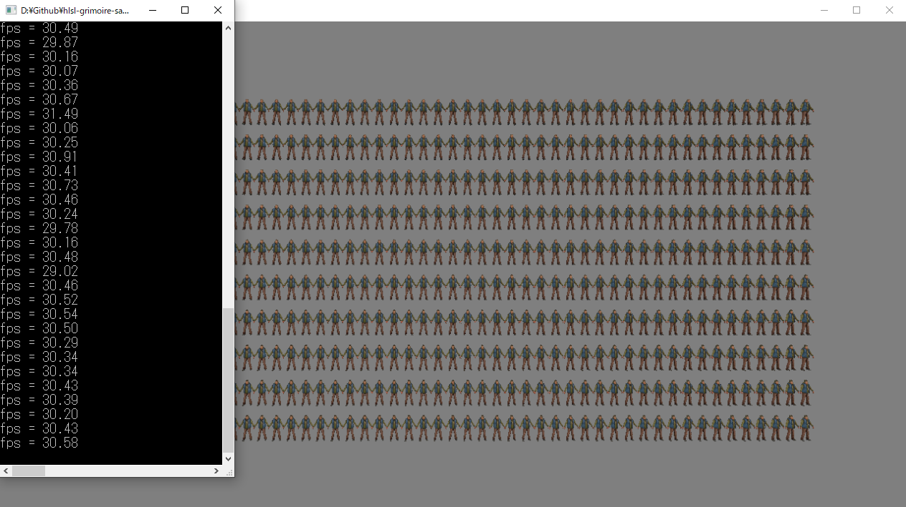
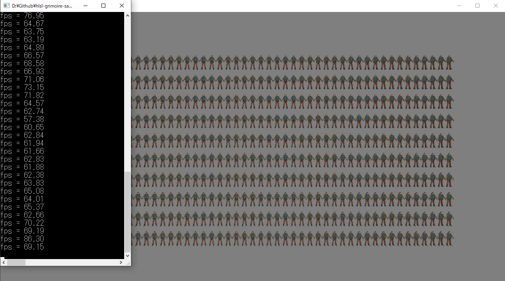
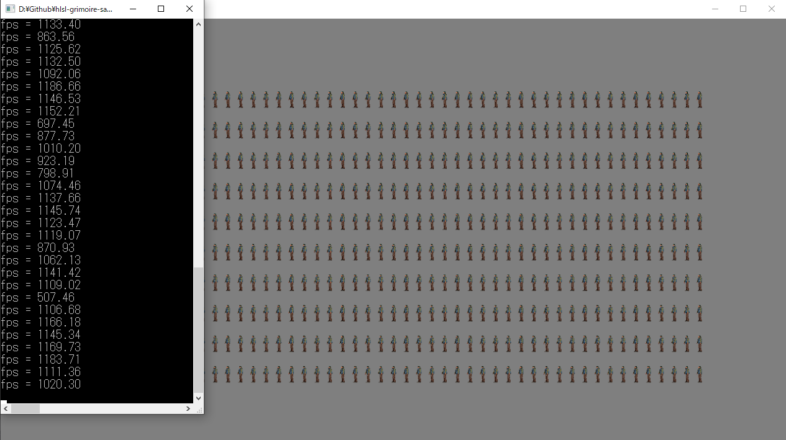

# Opt 5 大量のオブジェクトの描画
この節では、スポーツゲームの観客や、大地に生い茂っている草木など、大量のオブジェクトを描画するテクニックについて見ていきます。

## Opt 5.1 大量のオブジェクトを描画することの難しさ
&emsp;ゲームにおいて、大量のオブジェクトを描画するということは、メモリ使用量、CPUパフォーマンス、GPUパフォーマンスといった様々な問題を解決する必要があります。これらの問題を解決する方法として、様々な方法が用いられてきました。この節では、これらの問題を解決するために次の３つのテクニックを紹介します。
1. Flyweightパターン
2. インスタンシング描画
3. モデルをオフスクリーン描画して、板ポリをインスタンシング描画
&emsp;まず、Flyweightパターンはメモリ使用量の問題を解決してくれるデザインパターンです。例えば、同じモデルを100体表示したいときに次のようなプログラムを記述したとします。
```cpp
// 人物のモデルの初期化データを設定する。
ModelInitData modelInitData;
modelInitData.m_tkmFilePath = "Assets/modelData/human.tkm";
modelInitData.m_fxFilePath = "Assets/shader/preset/sample3D.fx";

// 初期化データを使用して、モデルを初期化する。
Model model[100];
for( int i = 0; i < 100; i++){
	model[i].Init( modelInitData );
}
```
&emsp;このコードは同じ人物のモデルの初期化データを使って、Modelクラスのインスタンスを初期化を100体分実行しています。を見ると賢明な方であれば、頂点バッファやインデックスバッファやテクスチャとか共通できるリソースを重複してロードしているのではないか？メモリが無駄に使われているのではないか？といった不安を覚えると思います。実際この後のハンズオンでこのようなコードを描いてもらうことになります。結論を言いますと、本書のModelクラスはFlyweightパターンというデザインパターンで設計されているため、共通のリソースは使いまわすという実装になっているため、無駄なメモリ確保が行われることはありません。本書はデザインパターンの書籍ではないため、Flyweightパターンの詳細については割愛しますが、このデザインパターンは、シンプルな実装で共通リソースを使いまわすための良い設計をを与えてくれるパターンです。有名なGoF本、Robert Nystrom氏のGame Programming Patternsなどにも紹介されていますので、興味がある方は是非読んでみてください。
&emsp;続いて、CPUパフォーマンスの問題を解決してくれるテクニックのインスタンシング描画を紹介します。こちらは後ほど詳細に解説を行いますが、例えば、100体のモデルのドローコールを実行しようとすると次のようなプログラムを記述することが想像できます。

```cpp
for( int i = 0; i < 100; i++){
	model[i].Draw( renderContext );
}
```
&emsp;これが真っ先に思いつく実装方法だと思いますが、モデルのドローコールというのは非常に重い処理です。Unityで最適化を行ったことがある方であれば、ドローコールの削減の話は聞いたことがあると思います。ドローコールを削減することは、Unityだけではなくほとんどのプラットフォームにおいて高速化に結びつきます。この問題を解決してくれるのがインスタンシング描画です。インスタンシング描画を行うと、先ほどのような100体の同じモデルの描画を一回のドローコールで実行できるようになります。次のコードはインスタンシング描画行っている疑似コードです。

```cpp
model.DrawInstancing( 
	renderContext, 
	100	// 第二引数はインスタンスの数
);
```
&emsp;最後にGPUパフォーマンスの問題を解決するテクニックを紹介します。先ほど紹介したインスタンシング描画は、基本的にCPUパフォーマンスを改善するためのテクニックで、GPUのためのテクニックではありません。ドローコールの数が減ろうが、GPU的には座標変換する頂点の総数や、塗りつぶすピクセルの数に変化があるわけではないので、何も変わらないのです(ただし、アーキテクチャによって、ドローコールの削減がGPUパフォーマンスの向上に影響を与えることもあります。今回紹介するテクニックの「モデルをオフスクリーン描画して、板ポリをインスタンシング描画」は、見た目のクォリティを大きく損なうことなく、GPUが扱う頂点数を1/100以下にまで削減するテクニックです。主にスポーツゲームの観客や、軍隊シミュレーションなどで利用されるテクニックです。このテクニックはAppend_03のドット絵風レンダリングとほぼ同じテクニックです。実装の詳細は後の4.3で見ていきます。

###  Opt 5.1.1 【ハンズオン】大量のオブジェクトを工夫もなしに表示する。
&emsp;では、まずはなんの工夫もなしに大量のオブジェクトを描画してみましょう。ただし、このハンズオンは特段変わったことはしていません。後に実装する4.2「インスタンシング描画」と4.3「モデルをオフスクリーン描画して、板ポリをインスタンシング描画」との対比のために実装をするだけです。ではOptional_04_01/Optional_04_01/slnを開いてください。
#### step-1 人物のモデルを初期化
&emsp;まずは人物のモデルを500体並べて表示するための初期化処理を実装します。main.cppの該当するコメントの箇所に次のコードを入力してください。

```cpp
// step-1 人物のモデルを初期化。
// モデルの初期化データを設定する。
ModelInitData modelInitData;
// tkmファイルのパスを指定。
modelInitData.m_tkmFilePath = "Assets/modelData/human.tkm";
// 使用するシェーダーファイルのパスを指定。
modelInitData.m_fxFilePath = "Assets/shader/preset/sample3D.fx";

const int width = 50;  // 列の数。
const int height = 10; // 行の数。
// 表示する人物のモデルは50×10の500体
const int numHumanModel = width * height;
// 500体分のModelクラスのインタンスを確保して、初期化する。
Model* humanModel = new Model[numHumanModel];
for (int i = 0; i < numHumanModel; i++) {
	humanModel[i].Init(modelInitData);
}
// 続いて、500体分の座標データを確保。
Vector3* humanPos = new Vector3[numHumanModel];
// 500体が綺麗に並ぶように座標を計算する。
int humanNo = 0;
for (int x = 0; x < width; x++) {
	for (int y = 0; y < height; y++) {
		humanPos[humanNo].x = -2400.0f + 100.0f * x;
		humanPos[humanNo].y = -1250.0f + 250.0f * y;
		humanPos[humanNo].z = 0.0f;
		humanNo++;
	}
}
```

&emsp;特殊なことは何もしていませんが、ModelクラスはFlyweightパターンで実装されているため、無駄なメモリ使用に関する問題はおきません。

#### step-2 500体分の人間モデルを描画する。
&emsp;続いて、ゲームループの処理です。毎フレーム500体の人物のモデルをドローしましょう。main.cppに次のプログラムを入力してください。
```cpp
 // step-2 500体分の人間モデルを描画する。
for (int i = 0; i < numHumanModel; i++) {
	// 人間モデルを描画。
	humanModel[i].Draw(renderContext);
	humanModel[i].UpdateWorldMatrix(humanPos[i], qRot, g_vec3One);

}
```

&emsp;入力出来たら、実行してください。うまく実行できていると図A4.1のようなプログラムが実行できます。著者の環境では500体の人物のモデルを表示すると30fps程度のパフォーマンスになっていました。</br>
**図A4.1**</br>
</br></br>


## Opt 5.2 インスタンシング描画
&emsp;では、続いてCPUのパフォーマンス向上を向上させるインスタンシング描画について見ていきます。インスタンシング描画は同じモデルを大量に描画する際に、ドローコールを一度だけにすることできるというテクニックです。ゲームでは大量の草木の描画や、スポーツゲームの観客の描画で利用されます。DirectX12でインスタンシング描画を行うことは簡単です。ID3D12GraphicsCommandList::DrawIndexedInstanced()関数を使ってドローコールを行うことで、インスタンシング描画が行えます。次のプログラムのように、この関数の第二引数に描画したいインスタンスの数を指定するとそこに指定された数分だけ、セットされているプリミティブを描画するための描画処理が実行されます。

```cpp
m_commandList->DrawIndexedInstanced(
	indexCount, 	// 第一引数はプリミティブのインデックス数
	100, 			// 第二引数はインスタンス数
	0, 
	0, 
	0
);
```
&emsp;さて、インスタンシング描画自体は確かにこれだけです。同じモデル50体を一度のドローコールで表示したいのであれば、先ほどの関数の第二引数に50を指定してやればいいのです。では、座標変換はどのようにすればいいのでしょうか。一度のドローコールで複数体分の描画処理が実行されてもGPUに送っているワールド座標が１つだけですと、同じ場所に50体表示されるだけです。これでは意味がありません。そこで、インスタンシング描画では、ストラクチャードバッファを利用して、ワールド行列の配列のようなインスタンシング描画用のデータをグラフィックメモリに送ります。後は、頂点シェーダーでこの配列を利用して、適切な座標変換を行えばいいのです。また、頂点シェーダーには、引数に描画中のインスタンスのIDが渡すことができます。このIDを利用して、ワールド行列の配列から、適切な行列を引っ張ってきて、複数体のモデルを適切な位置に表示するわけです。</br>

&emsp;では、インスタンシング描画についてまとめます。
1. インスタンスの数を指定して、ドローコールを実行する。(C++側)
2. インスタンスの数分のワールド行列の配列をグラフィックメモリに送る。(C++側)
3. 頂点シェーダーでインスタンスのIDを利用して、適切な座標変換を行う。(シェーダー側)
&emsp;では、この３点を意識しながら、インスタンシング描画を実装してきましょう。

## 評価テスト5-1
次の評価テストを行いなさい。</br>
[評価テストへジャンプ](https://docs.google.com/forms/d/e/1FAIpQLSfQDFnZIjSkN1zycsBaap3u31mulP5mddTLcgwRPitYuPAGrg/viewform?usp=sf_link)

<!-- 改ページ. -->
<div style="page-break-before:always"></div>

### Opt 5.2.1 【ハンズオン】大量のオブジェクトをインスタンシング描画で表示する。
&emsp;4.1.1と同様のモデルを、今度はインスタンシング描画で500体表示してみます。4.1.1のプログラムとの差異を意識して実装してきましょう。では、Optional_04_02/Optional_04_02.slnを立ち上げてください。

#### step-1 500体分のモデルの座標を計算する。
&emsp;まずは、先ほどと同じように500体分のモデルの座標を計算するプログラムを入力します。main.cppの該当するコメントの箇所に次のプログラムを入力してください。
```cpp
// step-1 500体分のモデルの座標を計算する。
const int width = 50;
const int height = 10;
const int numHumanModel = width * height;
Vector3* humanPos = new Vector3[numHumanModel];    

int humanNo = 0;
for (int x = 0; x < width; x++) {
	for (int y = 0; y < height; y++) {
		// 1000体のモデルが綺麗に並ぶように、座標を計算する。
		humanPos[humanNo].x = -2400.0f + 100.0f * x;
		humanPos[humanNo].y = -1250.0f + 250.0f * y;
		humanPos[humanNo].z = 0.0f;

		humanNo++;
	}
}
```

#### step-2 500体分のワールド行列関係の各種バッファを確保。
&emsp;step-2では、500体分のワールド行列をcpp側で計算して記憶しておくための行列の配列の確保と、そのデータをグラフィックメモリに送るためのストラクチャードバッファの確保を行っています。main.cppに次のプログラムを入力してください。
```cpp
// step-2 500体分のワールド行列関係の各種バッファを確保。
// まずは計算用のバッファをメインメモリ上に確保する。
Matrix* worldMatrixArray = new Matrix[numHumanModel];
// 続いて、シェーダー側でワールド行列を使用するためのストラクチャードバッファをVRAM上に確保する。
StructuredBuffer worldMatrixSB;
worldMatrixSB.Init(
	sizeof(Matrix), // 第一引数は１要素のサイズ。
	numHumanModel,  // 第二引数は要素数。
	nullptr         // 第三引数は初期値データ。初期値は指定しないので、今回はnullptr。
);
```

#### step-3 人物のモデルを初期化。
&emsp;続いて、画面に表示する人物のモデルの初期化を行います。ここで注目してほしいのが、4.1.1のハンズオンでは、500体分のモデルを初期化していたのが、今回は１体しか初期化をしていない点です。これはインスタンシング描画を使って、１回の描画で５００体を表示するように実装していっているからです。また、拡張SRVに先ほど確保したストラクチャードバッファを指定している点にも注目してください。このストラクチャードバッファを利用して、頂点シェーダーで適切な座標変換を行います。main.cppに次のプログラムを入力してください。
```cpp
// step-3 人物のモデルを初期化。
// モデルの初期化データを設定する。
ModelInitData modelInitData;
// tkmファイルのパスを指定。
modelInitData.m_tkmFilePath = "Assets/modelData/human.tkm";
// 使用するシェーダーファイルのパスを指定。
modelInitData.m_fxFilePath = "Assets/shader/sample3DInstancing.fx";
// 【注目】拡張SRVにストラクチャードバッファを渡す。
modelInitData.m_expandShaderResoruceView[0] = &worldMatrixSB;
// 設定したデータでモデルを初期化。
Model humanModel;
humanModel.Init(modelInitData);
```

#### step-4 ワールド行列を計算する。
&emsp;ここからはゲームループの処理です。Model::CalcWorldMatrix()関数を利用して、500体分のワールド行列を計算して、メインメモリのバッファに記憶していきます。次のプログラムをmain.cppに入力してください。
```cpp
// step-4 ワールド行列を計算する。
for (int i = 0; i < numHumanModel; i++) {
	// ワールド行列を計算する。
	worldMatrixArray[i] = humanModel.CalcWorldMatrix(humanPos[i], qRot, g_vec3One);
}
```
#### step-5 ワールド行列の内容をグラフィックメモリにコピー。
&emsp;続いて、先ほど計算したわーる行列のデータをグラフィックメモリ上のストラクチャードバッファにコピーします。main.cppに次のプログラムを入力してください。
```cpp
// step-5 ワールド行列の内容をグラフィックメモリにコピー。
worldMatrixSB.Update(worldMatrixArray);
```

#### step-6 人物のモデルをインスタンシグ描画。
&emsp;C++側最後のプログラムです。人物のモデルをインスタンシング描画しましょう。main.cppに次のプログラムを入力してください。
```cpp
// step-6 人物のモデルをインスタンシグ描画。
humanModel.DrawInstancing(renderContext, numHumanModel);
```
&emsp;Model::DrawInstancing()関数の第二引数がインスタンスの数です。この関数呼び出しの奥の方で、ID3D12GraphicsCommandList::DrawIndexedInstanced()関数を利用してインスタンシング描画命令が発行されています。今回のインスタンシング描画のcpp側の流れは、著者の用意しているクラスでラップされており、プログラムは簡略化されていますが、それでもDirectX12のAPIを直接実行した場合の流れと全く同じです。興味がある方は是非エンジンコードの中身まで追いかけてみてください。

#### step-7 ワールド行列の配列にアクセスするための変数を追加。
&emsp;ここからはインスタンシング描画を行うシェーダー側のプログラムです。Assets/shader/sample3DInstancing.fxを開いてください。まずは、ワールド行列の配列にアクセスするための変数を追加します。ワールド行列の配列はt10レジスタに関連付けられています。では、sample3DInstancing.fxの該当するコメントの箇所に次のプログラムを入力してください。
```cpp
// step-7 ワールド行列の配列にアクセスするための変数を追加。
StructuredBuffer<float4x4> g_worldMatrixArray : register( t10 );
```

#### step-8 頂点シェーダーの引数にインスタンスIDを追加。
&emsp;続いて、頂点シェーダのエントリーポイントに、現在処理しているインスタンスのIDを引数で渡せるようにしてやりましょう。HLSLにはSV_InsntaceIDというセマンティクスが用意されています。このセマンティクスを指定するとインすんタスのIDを頂点シェーダーに渡せます。では、sample3DInstancing.fxに次のプログラムを入力してください。
```cpp
// step-8 頂点シェーダーの引数にインスタンスIDを追加。
uint instanceId : SV_InstanceID
```

#### step-9 ワールド行列の配列とインすｔナスIDを利用して座標変換。
&emsp;では、これで最後です。ワールド行列の配列とインスタンスIDを利用して、頂点を適切なワールド座標に変換するプログラムを実装しましょう。sample3DInstancing.fxに次のプログラムを入力してください。
```cpp
 // step-9 ワールド行列の配列とインスタンスIDを利用して座標変換。
float4x4 m = g_worldMatrixArray[instanceId];
psIn.pos = mul(m, vsIn.pos);
psIn.pos = mul(mView, psIn.pos);
psIn.pos = mul(mProj, psIn.pos);
```
&emsp;入力出来たら実行してみて下さい。正しく実装できていると図A4.2のようなプログラムが実行できます。fpsが表示されていますので、そちらに注目してください。著者の環境では、インスタンシング描画を行うことで、60fpsまで向上しました。
**図A4.2**</br>
</br></br>


## Opt 5.3 オフスクリーンレンダリングされた絵を貼り付ける
&emsp;では、いよいよ最後です。最後の処理はAppendix 3のドット絵風レンダリングのテクニックを使います。ここまで実装してきたデモはGPUの頂点処理がネックになって大きくパフォーマンスを落としていました。今回表示しているモデルの頂点数は5358頂点となっています。このモデルを500体も描画するということはGPUにとって大きな負荷となっていました。そこで今回は人物のモデルは一体だけオフスクリーンレンダリングして、そのテクスチャを貼り付けられた板ポリをインスタンシング描画で500枚表示するという実装をしてみようと思います。

### Opt 5.3.1【ハンズオン】大量のオブジェクトをオフスクリーンレンダリングとインスタンシング描画で表示する
&emsp;では、早速実装していきましょう。今回実装する必要があるのはc++側だけです。今回は4.2のインスタンシング描画から変更を行う必要がある点だけに着目して実装していきます。Optional_04_03/Optional_04_03.slnを開いてください。

#### step-1 人物のモデルを描画するレンダリングターゲットを初期化。
&emsp;まずは人物のモデルを描画するレンダリングターゲットを初期化します。では、main.cppの該当するコメントの箇所に次のプログラムを入力してください。
```cpp
// step-1 人物のモデルを描画するレンダリングターゲットを初期化。
float clearColor[4] = { 0.0f, 0.0f, 0.0f, 0.0f };
RenderTarget drawHumanModelRT;
drawHumanModelRT.Create(
	512,    // 横幅512
	512,    // 縦幅512
	1,
	1,
	DXGI_FORMAT_R8G8B8A8_UNORM,
	DXGI_FORMAT_D32_FLOAT,
	clearColor
);
```

#### step-2 人物のモデルを初期化。
&emsp;続いて、人物のモデルの初期化処理を実装します。今回は人物はインスタンシング描画ではなく、普通の描画を行うので、シンプルな初期化のみを行っています。main.cppに次のプログラムを入力してください。
```cpp
// step-2 人物のモデルを初期化。
// モデルの初期化データを設定する。
ModelInitData modelInitData;
// tkmファイルのパスを指定。
modelInitData.m_tkmFilePath = "Assets/modelData/human.tkm";
// 通常の3Dモデル描画用のシェーダーを指定する。
modelInitData.m_fxFilePath = "Assets/shader/preset/sample3D.fx";
// 設定したデータでモデルを初期化。
Model humanModel;
humanModel.Init(modelInitData);
```

#### step-3 人物のモデルを描画するためのカメラを作成。
&emsp;続いて、人物のモデルを描画するためのカメラを作成します。これはドット絵風レンダリングの時に作成したカメラと同じです。main.cppに次のプログラムを入力してください。
```cpp
// step-3 人物のモデルを描画するためのカメラを作成。
Camera drawHumanModelCamera;
drawHumanModelCamera.SetUpdateProjMatrixFunc(Camera::enUpdateProjMatrixFunc_Ortho);
drawHumanModelCamera.SetWidth(200.0f);
drawHumanModelCamera.SetHeight(200.0f);
drawHumanModelCamera.SetNear(1.0f);
drawHumanModelCamera.SetFar(1000.0f);
drawHumanModelCamera.SetPosition(0.0f, 100.0f, 200.0f);
drawHumanModelCamera.SetTarget(0.0f, 100.0f, 0.0f);
drawHumanModelCamera.SetUp(0.0f, 1.0f, 0.0f);
drawHumanModelCamera.Update();
```

#### step-4 人物のモデルのテクスチャを貼り付ける板ポリモデルを初期化。
&emsp;step-4では、板ポリモデルを初期化します。今回の実装では、この板ポリをインスタンシング描画で500枚表示します。インスタンシング描画を行うための初期化設定が行われているので、そこに注目して、プログラムを入力してください。では、main.cppに次のプログラムを入力してください。
```cpp
// step-4 人物のモデルのテクスチャを貼り付ける板ポリモデルを初期化。
ModelInitData planeModelInitData;
modelInitData.m_tkmFilePath = "Assets/modelData/plane.tkm";
// 【注目】インスタンシング描画用のシェーダーを指定する。
modelInitData.m_fxFilePath = "Assets/shader/preset/sample3DInstancing.fx";
// 【注目】拡張SRVにストラクチャードバッファを渡す。
modelInitData.m_expandShaderResoruceView[0] = &worldMatrixSB;
Model planeModel;
planeModel.Init(modelInitData);
// 【注目】板ポリモデルのアルベドテクスチャを差し替える。
planeModel.ChangeAlbedoMap("", drawHumanModelRT.GetRenderTargetTexture());
```

#### step-5 人物のモデルを描画。
&emsp;ここからはゲームループの処理です。まずは人物のモデルをオフスクリーンレンダリングします。これはドット絵風レンダリングの処理と同じです。では、main.cppの該当するコメントの箇所に次のプログラムを入力してください。
```cpp
// step-5 人物のモデルを描画。
// レンダリングターゲットとして利用できるまで待つ
renderContext.WaitUntilToPossibleSetRenderTarget(drawHumanModelRT);
// レンダリングターゲットを設定
renderContext.SetRenderTargetAndViewport(drawHumanModelRT);
// レンダリングターゲットをクリア
renderContext.ClearRenderTargetView(drawHumanModelRT);
// 人間モデルを描画。
humanModel.Draw(renderContext, drawHumanModelCamera);
// レンダリングターゲットへの書き込み終了待ち
renderContext.WaitUntilFinishDrawingToRenderTarget(drawHumanModelRT);
```

#### step-6 レンダリングターゲットをフレームバッファに戻す。
&emsp;人物のモデルのオフスクリーンレンダリングができたので、次は板ポリをフレームバッファに描画します。まずはレンダリングターゲットをフレームバッファに戻しましょう。次のプログラムをmain.cppに入力してください。

```cpp
// step-6 レンダリングターゲットの設定をフレームバッファに戻す。
// レンダリングターゲットをフレームバッファに戻す。
renderContext.SetRenderTarget(
	g_graphicsEngine->GetCurrentFrameBuffuerRTV(),
	g_graphicsEngine->GetCurrentFrameBuffuerDSV()
);
// ビューポートとシザリング矩形を指定する。
D3D12_VIEWPORT viewport;
viewport.TopLeftX = 0;
viewport.TopLeftY = 0;
viewport.Width = 1280;
viewport.Height = 720;
viewport.MinDepth = 0.0f;
viewport.MaxDepth = 1.0f;
renderContext.SetViewportAndScissor(viewport);
```

#### step-7 板ポリモデルをインスタンシング描画。
&emsp;では、いよいよ最後の実装です。人物のモデルのテクスチャが貼り付けられた板ポリをインスタンシング描画で500枚表示しましょう。次のプログラムをmain.cppに入力してください。
```cpp
// step-7 板ポリモデルをインスタンシング描画。
// ワールド行列を計算する。
for (int i = 0; i < numHumanModel; i++) {
	// ワールド行列を計算する。
	worldMatrixArray[i] = humanModel.CalcWorldMatrix(humanPos[i], g_quatIdentity, g_vec3One);
}
// ワールド行列の内容をグラフィックメモリに描画。
worldMatrixSB.Update(worldMatrixArray);

// 板ポリモデルをインスタンシング描画。
planeModel.DrawInstancing(renderContext, numHumanModel);
```
&emsp;板ポリのインスタンシング描画のために、枚数分のワールド行列の計算をしてから、インスタンシング描画を行っています。流れは4.2のインスタンシング描画と全く同じです。入力出来たら実行してみてください。図A4.3のようなプログラムが実行できます。</br>
**図A4.3**</br>
</br></br>
&emsp;著者の環境では、1000fpsが出ていました。当初、何も工夫せずに人物を500体表示したところ30fpsだったものが、人物をインスタンシング描画すると60fps、板ポリをインスタンシング描画に変更すると1000fpsと破格の高速化が実現できました。しかも実行してみると分かりますが、もしこれが、スポーツゲームの遠景の観客などであれば、見た目のクオリティも全く気にならないレベルです。</br>

## Opt 5.4 最後に
&emsp;今の最新の環境であっても、大量のオブジェクトを表示するというのは、なにも工夫しなければ難しいことです。しかし、今回見てきたように、いくつかのテクニックを活用することで、クォリティを損なうことなく驚くほどの高速化が実現できました。昨今のPS4などのゲームであれば、ゲーム中にもっと多くのオブジェクトが表示されているように、ユーザーは感じているかと思います。これを実現するために、ゲーム開発者はあの手、この手のトリック、テクニックを駆使してゲームを開発しています。もちろんこれはオブジェクトの表示だけの話ではなく、サウンド、あたり判定、AIなど様々な処理で高速に動作させるために、様々な工夫がされています。今回のOpt 5「大量のオブジェクトの描画」を通して、開発者の知恵と工夫が少しでも伝われば幸いです。
